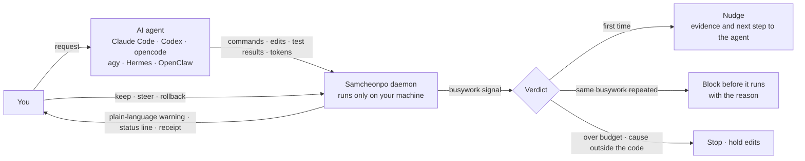
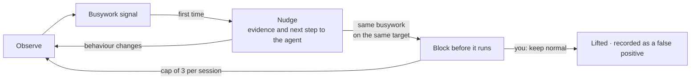
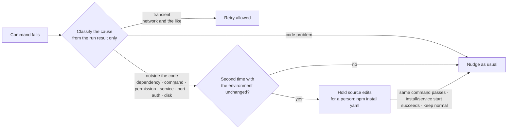
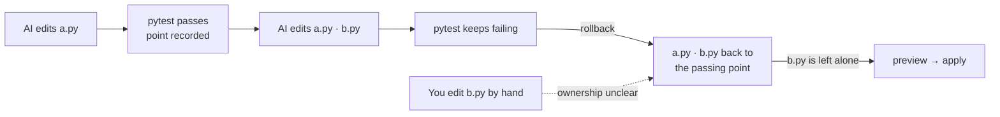

<div align="center">

<picture>
  <source media="(prefers-color-scheme: dark)" srcset="docs/assets/logo-dark.png">
  
</picture>

**A harness that notices when an AI coding agent is burning your time and money on busywork, tells you, and stops it**

[](https://github.com/JinHo-von-Choi/anti-samcheonpo/actions/workflows/ci.yml)
[](LICENSE)
[](https://go.dev/dl/)

[한국어](README.md) | English

</div>

---

## Why it exists

When vibe-coding, the gap between engineers and non-engineers is simple: engineers notice immediately when an agent gets stuck. They spot repeated commands or drift right away on the terminal screen. Non-programmers rarely catch it early.

The waste follows predictable patterns:

- **Verifying far more than needed.** The output never changes, yet the agent reruns identical test suites over and over until token allowances evaporate.
- **Going the wrong way.** You asked it to fix a login bug, and now it is rewriting the whole login system.
- **Going in circles.** Faced with a problem the model cannot handle, it keeps failing even simple steps in an endless loop. It also tries to solve with code what code cannot solve: a package that cannot be installed, a server that is down.

Meanwhile, the AI keeps promising it is "almost done". You sit there watching while time and money drain away. Samcheonpo is a harness built to cut this **dumb cost**. The name comes from a Korean idiom: when a conversation wanders off somewhere unrelated, it "falls into Samcheonpo". This tool catches the moment your task does.

## At a glance

Samcheonpo sits between you and the agent. It judges progress strictly by what ran, never by what the model claims.



## How it helps

**1. It watches.**
It hooks into the agent and tracks execution in real time: commands run, files edited, test results, and tokens spent. Actual execution overrides agent claims.

**2. It tells you in plain words.**
Instead of opaque logs, it shows direct warnings (currently Korean; translations below):

```text
AI가 같은 시험을 4번 돌렸는데, 그 사이 코드는 한 글자도 바뀌지 않았습니다.
코드 밖 조건(설치되지 않은 의존성) 때문일 가능성이 높은 실패로 같은 명령이 2번 실패했습니다.
AI가 요청 범위 밖 파일을 고쳤습니다 (src/theme/dark.css, 누적 2개).
```

> The AI ran the same test 4 times, and not a single character of code changed in between.
> The same command failed twice, most likely because of a condition outside the code (a missing dependency).
> The AI edited files outside the requested scope (src/theme/dark.css, 2 so far).

Each warning ends with a sentence you can copy straight to the agent. Available options follow right after: keep now (allow once), keep normal (this call is wrong), steer, and summary.

A status line leads with one of four states. Silence alone never equals success:

| State | Meaning |
| --- | --- |
| Going well (순조로움) | There is progress evidence such as a passing check, and no warning since |
| Watching (지켜보는 중) | No progress evidence yet, or one light notice was given |
| Step in now (지금 끼어드세요) | Repeated busywork or a block stands |
| Unknown (확인 불가) | Observation is incomplete, so no judgement is possible |

Next comes progress 1/2, idle spend at API rates ₩1,240, and busywork 12% (of what was measured).

```text
[지켜보는 중] 진척 1/2 · 공회전 API환산 1,240원 · 헛짓 12% (계측분)
```

**3. If ignored, it blocks.**
The agent first receives a gentle nudge with the relevant evidence attached. But if it repeats the exact same busywork against the same target within the same session after that warning, Samcheonpo intercepts the next run **before it executes** and reports why. False alarm? A single `/samcheonpo:keep normal` clears the block.



**4. It lets you look back.**
Run `samcheonpo audit` against stored Claude Code and Codex logs to trace where tokens went. The check splits real work from wasteful wheel-spinning. It works completely offline without making model calls, keeping your raw data safe on your local drive.

> The amounts Samcheonpo shows are **measured tokens converted at API prices**, in Korean won. They are not your actual bill or savings. When usage is unknown it says "unknown", not ₩0.

---

## What it catches

| Dumb cost | Signals Samcheonpo watches | Intervention |
| --- | --- | --- |
| **Over-verification** | Same test repeated with no code change · rerunning a check that already has passing evidence · re-verifying after touching only docs · repeating the same review on the same state · rerunning a long full suite right after a few-line change (only suites measured at over 5 minutes; the same suite behind a runner script counts as the same) · starting a long load or soak run without a short probe | Nudge → block before running on repeat (shows the earlier result) |
| **Drifting off task** | Editing files outside the requested scope · editing protected paths · faking a real service to make tests pass · reverting to an old goal after context compaction | Nudge · immediate block on protected paths · shows what you asked next to what it is doing · right after a context compaction, once, restates the goal, protected paths and remaining done-conditions in one line |
| **Capability loops** | Same error after every fix (also when the output goes to a log or `tail` masks the exit status) · an external checker rejecting the same way after every edit · patching a browser-test timing failure by changing only expected text or waits · working through an analysis report one finding at a time · failing while editing the same files again and again · retrying a fix that already failed (even across sessions) · flip-flopping edits (including ones that only rename or reformat) · repeated failures most likely caused by conditions outside the code | Nudge → block on repeat → stop auto-retries and write a handoff note. A confirmed cause outside the code is handled as described under "Problems outside the code" below |
| **False "done"** | Deleting, skipping or weakening tests · code that hides errors · declaring "done" while the done-check fails | Nudge → block on repeat |
| **Runaway cost** | Spend piling up without progress · abnormal spend rate · exceeding your budget · a tree of parent and child sessions exceeding its shared budget · session active time and tokens (notice at 2 hours or 10M, ask at 4 hours or 30M) | Alert · stop when over budget · past the tree limit every session in that tree is refused before its next run · with a session ceiling set, only reading is allowed past it until `/samcheonpo:extend` |
| **Release loops** | Shipping again after a failed remote CI run without reproducing it locally (the failed tests, or the full check, must pass) · shipping a change no check ran on since the last release · shipping while a browser test fails on timing · too many releases per hour | Nudge → treated as the same call whatever the new tag, blocked before running on repeat |

### Problems outside the code cannot be fixed with code

Code edits will not fix an uninstalled package, a down server, missing permissions, or an occupied port. When a command fails twice with an identical external cause and an untouched environment, Samcheonpo pauses source edits before execution until the blocker clears, printing the exact fix command for a human to run.



Dependency manifests (`package.json`, `requirements.txt` and the like) stay editable during a hold. Timeouts and kills can stem from code faults, so they never trigger one.

### Principles

1. **Judge by results.** Decisions rest on command results, working-tree state and test results, not on what the AI says about itself.
2. **Never block on counts alone.** It blocks only when input and environment are unchanged and there is no new information and no progress. Code changes unblock retries. If the prior failure came from a service, dependency, permission or network problem, the next rerun is let through once as a recovery check, and an install or service command in between starts the count over.
3. **Give a reason when blocking.** It reports the basis for the decision alongside concrete next steps, never fabricating command output.
4. **Say "unknown" when it does not know.** Missing measurements show as unknown, not ₩0; estimates are labeled as estimates.
5. **Keep records on your machine.** No remote upload or external judge model runs unless you explicitly turn it on.

---

## Install

### Release archive

Grab `samcheonpo_0.5.2_<os>_<arch>.tar.gz` and `SHA256SUMS` from [Releases](https://github.com/JinHo-von-Choi/anti-samcheonpo/releases). Archives exist for linux, darwin and windows on amd64 and arm64. Each package was built on its matching GitHub Actions runner and passed keyless install, uninstall, audit, and first-hook checks.

```bash
sha256sum -c --ignore-missing SHA256SUMS   # on macOS: shasum -a 256 -c
tar -xzf samcheonpo_0.5.2_linux_amd64.tar.gz
mkdir -p ~/.local/bin && cp samcheonpo samcheonpo-hook ~/.local/bin/
samcheonpo doctor
```

On Windows, unpack using `tar -xzf` and place `samcheonpo.exe` and `samcheonpo-hook.exe` together in a folder on your PATH (Git for Windows is required).

Keep the primary `samcheonpo` binary right alongside `samcheonpo-hook` in that folder.

### From source

Go 1.27 or later is required. Linux x86-64 is the sole platform verified with live agent runs; see the support table below for macOS and Windows coverage.

```bash
go install github.com/JinHo-von-Choi/anti-samcheonpo/cmd/samcheonpo@v0.5.2
go install github.com/JinHo-von-Choi/anti-samcheonpo/cmd/samcheonpo-hook@v0.5.2
```

Windows requires Windows 10 1803 or later alongside Git for Windows. The full test suite, conformance cases, hook latency check, and release-candidate smoke tests pass on Windows 11 arm64. A real Claude Code run there triggered hooks, flagged a repeat, and blocked the subsequent run before execution. Other agents remain unverified.

---

## Quick start

**1. See where your tokens went in the last 30 days.** Run it right after installing. It changes nothing on your machine:

```bash
samcheonpo audit --since 30d
```

```text
계측된 토큰               26871.5M토큰
  진척 (추정)              3423.1M토큰    13%
  필요한 탐색             13523.5M토큰    50%
  헛짓                      770.3M토큰     3%
실시간이었다면 개입 1418회
헛짓 상위 세션
  3f2a91c0  09-08 10:10     26.7M토큰  헛짓  18%  결제 화면 오류 고쳐 줘
```

The output breaks down measured tokens, estimated progress, necessary exploration, and busywork, alongside the 1418 times it would have stepped in live and the top busywork sessions (like "fix the checkout page error"). Run `samcheonpo receipt <session>` to inspect any individual session.

**2. Connect it to your agent.**

```bash
samcheonpo install --agent claude     # Claude Code (plugin and status line)
samcheonpo install --agent codex      # Codex
samcheonpo install --agent opencode   # opencode
samcheonpo install --agent agy        # Antigravity CLI (~/.gemini/config/hooks.json)
samcheonpo install --agent hermes     # Hermes (plugin, via hermes plugins enable)
samcheonpo install --agent openclaw   # OpenClaw (plugin, via openclaw plugins install)
```

Existing hooks and status line configs stay intact. Start working as usual. On the first hook call, a background daemon spins up automatically.

**3. Commands during work (Claude Code)**

| Command | What it does |
| --- | --- |
| `/samcheonpo:summary` | Plain-language summary: what you asked, what it is doing, what is done, what is stuck, what it cost |
| `/samcheonpo:keep normal` | Report that the last call was wrong; the same call on the same target will not block again within the current goal (protected paths and budgets still apply) |
| `/samcheonpo:keep now` | Let it through this once; if it happens again, advise before blocking |
| `/samcheonpo:steer` | Pass Samcheonpo's prescription to the agent |
| `/samcheonpo:check` | Run the done-check now |
| `/samcheonpo:rollback` | Put files the AI changed with its write tools back to the last progress a passing check confirmed. Without arguments it previews; `apply <plan ID>` performs exactly the previewed plan |
| `/samcheonpo:rollback golden` | List the AI's files recorded at each passing check. `golden <id>` previews a return to that point, `golden <id> apply <plan ID>` performs it. The five most recent points are kept |
| `/samcheonpo:extend 2h` | Raise the session ceiling you set. Time as `2h`, `30m`; tokens in capitals as `20M`, `500K` |
| `/samcheonpo:accept`, `/samcheonpo:edit` | Accept or edit a work contract (when you use one) |

`/samcheonpo:summary` example:

```text
요청한 일: "src/auth/session.py 만료 처리 고쳐 줘"
지금 하는 일: 최근에 src/theme/dark.css, src/auth/session.py를 바꿨다, 마지막 명령은 `pytest -q`.
요청 범위 밖으로 보이는 변경: src/theme/dark.css. 의도한 변경이 아니라면 방향을 다시 알려 주면 된다.
끝난 것: 아직 확인된 진척이 없다.
```

> Asked: "fix the expiry handling in src/auth/session.py"
> Doing now: recently changed src/theme/dark.css and src/auth/session.py; last command was `pytest -q`.
> Changes that look out of scope: src/theme/dark.css. If that was not intended, just tell it the direction again.
> Done: no confirmed progress yet.

**4. Disconnect.**

```bash
samcheonpo uninstall --agent claude
```

Uninstallation leaves user-modified files untouched. It also resets the agent hooks to their original shape.

---

## Rollback

Rollback restores files the AI modified to the last passing check. At every passing check, the tool saves snapshots of the AI's files under `.samcheonpo/snapshots`. Because of this local storage, restoring a previous state still works even if the daemon restarts in the meantime.



One rule applies here. **Only files the AI changed with its write tools, and nobody touched since, are returned.** Files you edited by hand, files updated by shell scripts, and symlinks stay untouched. The preview lists each skipped path with an explanation. Meanwhile, any overwritten content gets backed up under `~/.samcheonpo/backup/`.

---

## Work contract (optional)

The harness starts in **observe-only** mode by default. If you want hard guardrails before an agent marks a task complete, define a contract file.

```yaml
# .samcheonpo/contract.yml
goal: send the user to the re-login screen when the session expires
done:
  - check: "pytest -q tests/test_session.py"
scope:
  allow: ["src/auth/**", "tests/**"]
  protect: ["migrations/**"]
budget: {krw: 5000, minutes: 40}
```

Approve the draft using `/samcheonpo:accept`. Once accepted, the harness runs test checks directly, locks down protected directories, and kills any run that exceeds configured limits. Set `contract: {draft: on}` inside `.samcheonpo.yml` if you want automatic drafts for new work.

Any modification to an accepted contract requires re-approval. This rule applies even to goal edits. The tool signs every approval record using a private key in your home directory, so an agent cannot forge an approval or copy one from another project.

## Configuration (`.samcheonpo.yml`, `~/.samcheonpo/config.yml`)

```yaml
rollout:
  mode: recommend            # shadow (record only) | recommend (nudge, block if ignored) | validated
  escalate_max_blocks: 3     # block cap per session; 0 disables blocking
contract:
  draft: off                 # on: request a contract draft for each new task
notify:
  desktop: true
swarm:
  tree_krw: 0                # shared budget (KRW) for a tree of parent and child sessions; 0 applies only the contract budget
detectors:
  s8_cost:
    notice_hours: 2          # session active-time notice on the status line; 0 turns it off
    warn_hours: 4            # ask the user whether to go on
    ceiling_hours: 0         # past it only reading is allowed until /samcheonpo:extend; 0 is none
    ceiling_tokens: 0        # the same ceiling in tokens (input, output, cache writes)
  s1_verify_treadmill:
    expensive_check_sec: 300 # rerunning tests that took longer than this right after a small change is judged
  s5_release:
    releases_per_hour: 2
```

A contract's `budget.minutes` also acts as an active-time session ceiling. Any gap between events longer than 30 minutes counts as time away and is excluded from active time.

Trees group connected sessions. They form exclusively through `samcheonpo handoff link` or when a session plugin passes `parent_session_id` at launch. If a session has no known lineage, it runs as its own standalone tree, which means another session cannot block it.

Project configurations can only loosen user-level limits. They cannot tighten detection, raise the block cap, expand the tree budget, or register outbound upload paths, notification targets, and external commands; project files may only disable those behaviors. New rules with unmeasured false-positive rates start strictly in `shadow_rules` for recording. Meanwhile, long-session rules (full-suite reruns, long runs, release loops, repeated rejections, browser timing, report triage, session length) enter directly at the nudge tier once verified against established false-positive scenarios and validated through replay against an actual 42-hour Codex run.

Research experiment mode (`experiment: {enabled: true}`) defaults to off. When turned on, it holds back select recommendations for control-group testing and flags this state directly on the status line. Project configs cannot enable it.

## Support

| Agent | Support | Verified version |
| --- | --- | --- |
| Claude Code | Observe · nudge · block before running · status line · slash commands | 2.1.x |
| Codex | Observe · nudge · block before running | 0.160.x–0.162.x |
| opencode | Observe · nudge · block before running | 1.18.x |
| Antigravity (agy) | Observe · nudge · block before running | 1.3.x |
| Hermes | Observe · nudge · block before running | 0.21.x |
| OpenClaw | Observe · nudge (from the next request) · block before running | 2026.7.x |
| GitHub Copilot · Cursor | Observe only | |

"Verified version" is the range whose hook payloads were captured into the tests. Other versions are not switched off: after an agent update, nudges and blocks continue as long as the hook payloads still carry the session, tool name, call ID, tool input (shell command, file path, patch) and result. Once a payload arrives whose shape actually changed, that agent is observed only, and the status line and `samcheonpo doctor` say why.

- agy: hooks do not carry tool results. Because of this, exit codes, output, and tokens are read straight from the conversation transcript, and a shell result is applied at the next event. agy lacks a session-end event, so no end-of-session receipt is written.
- OpenClaw: no hook changes the tool result that the model sees during a run. Advice attaches to the next request instead. Until that happens, repeats within the same run are not blocked.

| Platform | Status |
| --- | --- |
| Linux x86-64 | Install, uninstall, hook latency (p95 under 10 ms) and real agent runs verified |
| macOS | Installs from source. The full test suite including daemon, hooks and rollback, plus the conformance cases, pass on the GitHub Actions macOS runner. No real agent run yet |
| Linux arm64 | Installs from source; not verified running |
| Windows | Installs from source. On Windows 11 arm64 the full suite, the 17 conformance cases, the hook latency check (200 of 200 answered) and the release-candidate install, uninstall, audit and first-hook smoke pass. A real Claude Code session (hooks, repeat detection, refusal before the run) and x64 on CI are verified; other agents are not. Checks run in the bash of Git for Windows |
| WSL | Unverified with the Linux binary |

---

## Limitations

- **The effect is still being proven.** Pilot runs showed lower cost per completion on tasks where agents spin their wheels, but the samples are small, so no general savings rate is claimed. In a 2026-10-07 pilot with the real Claude Code (Sonnet) on 6 tasks, both arms completed 6/6 and there were no interventions; the tasks did not make the current model spin, so no effect could be measured. Methods and limits are in the [experiment protocol](docs/benchmarks/protocol-v1.md).
- **False positives can happen.** That is why it starts with nudges and blocks only when a warning was ignored on the same target in the same session, within a per-session cap. Report wrong calls with `/samcheonpo:keep normal`.
- **A pre-run block reaches the agent only if the decision finishes within the hook's wait (15 ms).** If it does not, the run is not blocked, and the status line shows the number of late decisions and `unknown`.
- **Rollback covers only files changed through write tools (Write, Edit) whose ownership is confirmed.** Files changed by shell commands, files with your edits mixed in, and links are not covered. The same holds for a return to a recorded passing point (`rollback golden`); files written by another session's agent are left alone because this session cannot confirm their ownership.
- **Holding edits for a cause outside the code can be wrong.** It applies only after the same command failed twice with the same external cause and no environment change, and `/samcheonpo:keep normal` lifts it at once. Timeouts (124) and kills (137) can be code causes and never trigger it.
- **The edit hold for causes outside the code and recorded passing points were each confirmed once with the real Claude Code; tree budgets, the post-compaction anchor and the HUD are covered by harness tests only.** What was and was not confirmed is listed in the [support matrix](docs/support-matrix.md) (Korean).
- **User-only commands are refused in the agent's shell, but this is not full isolation.** `accept`, `keep` and `rollback apply` run through the agent's shell tool are refused; a process of the same OS user connecting to the daemon socket directly is not stopped.
- **On short, clear tasks it has little to do.** Busywork mostly shows up in long, complex sessions.
- **Amounts are API-rate conversions.** They do not reflect your actual subscription bill or remaining quota.
- **Messages are in Korean.** The CLI output, nudges and summaries are currently Korean only.
- **If an agent's hook format changes,** some signals may be missed. Check the connection with `samcheonpo doctor`.

## Learn more

- [Getting started](docs/getting-started.md) · [Support and verification matrix](docs/support-matrix.md) · [Agent skill](plugins/claude-code/skills/samcheonpo/SKILL.md): how an AI sets up Samcheonpo and handles its warnings, blocks, and holds; installed with the Claude Code plugin (Korean)
- Specs: [progress contract](docs/spec/progress-contract-v1.md) · [evidence ledger](docs/spec/evidence-ledger-v1.md) · [receipt display](docs/spec/receipt-billing.md) · [recovery and causes outside the code](docs/spec/recovery-v1.md) · [handoff](docs/spec/handoff-v1-draft.md)
- Evaluation: `samcheonpo bench` (deterministic scenarios), `samcheonpo bench ab` (real agent comparison), `samcheonpo gaps` (spans the rules may have missed), `samcheonpo interventions` (how far each prescription got)
- [Conformance cases](conformance/) are public. Other tools can evaluate their outputs against the identical specification.

## License

[MIT](LICENSE)

---

<p align="center">
  Made by <a href="mailto:jinho.von.choi@nerdvana.kr">Jinho Choi</a> &nbsp;|&nbsp;
  <a href="https://buymeacoffee.com/jinho.von.choi">Buy me a coffee</a>
</p>
