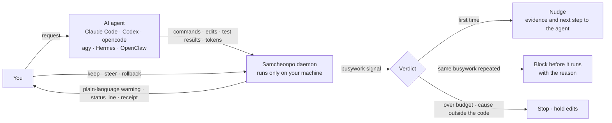
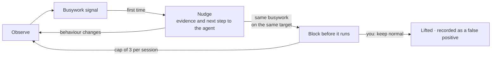
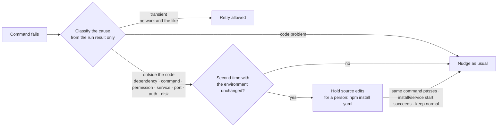
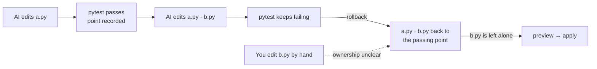

<div align="center">

<picture>
  <source media="(prefers-color-scheme: dark)" srcset="docs/assets/logo-dark.png">
  
</picture>

**A harness that notices when an AI coding agent is burning your time and money on busywork, tells you, and stops it**

[](https://github.com/JinHo-von-Choi/anti-samcheonpo/actions/workflows/ci.yml)
[](LICENSE)
[](https://go.dev/dl/)

[한국어](README.md) | English

</div>

---

## Why it exists

When vibe-coding, the real difference between engineers and non-engineers comes down to one skill: spotting an AI agent stuck in place. Developers spot this fast. They see the screen and step in immediately when a command repeats or the model drifts off course. Non-programmers rarely catch that drift early.

The waste follows predictable patterns:

- **Verifying far more than needed.** The output never changes, yet the agent reruns identical test suites over and over until token allowances evaporate.
- **Going the wrong way.** You asked it to fix a login bug, and now it is rewriting the whole login system.
- **Going in circles.** Faced with a problem the model cannot handle, it keeps failing even simple steps in an endless loop. It also tries to solve with code what code cannot solve: a package that cannot be installed, a server that is down.

All the while the AI says "almost done". You sit there watching, unaware, while time and money drain away. Samcheonpo is a harness built to cut this **dumb cost**. The name comes from a Korean idiom: when a conversation wanders off somewhere unrelated, it "falls into Samcheonpo". This tool catches the moment your task does.

## At a glance

Samcheonpo sits between the agent and you and judges only by what actually ran. What the AI says is not evidence.



## How it helps

**1. It watches.**
It hooks into the agent to see the commands it runs, the files it edits, the test results and the tokens it spends, in real time. It trusts actual runs over agent claims.

**2. It tells you in plain words.**
Instead of opaque log notices, it drops concrete warnings (currently Korean; translations below):

```text
AI가 같은 시험을 4번 돌렸는데, 그 사이 코드는 한 글자도 바뀌지 않았습니다.
코드 밖 조건(설치되지 않은 의존성) 때문일 가능성이 높은 실패로 같은 명령이 2번 실패했습니다.
AI가 요청 범위 밖 파일을 고쳤습니다 (src/theme/dark.css, 누적 2개).
```

> The AI ran the same test 4 times, and not a single character of code changed in between.
> The same command failed twice, most likely because of a condition outside the code (a missing dependency).
> The AI edited files outside the requested scope (src/theme/dark.css, 2 so far).

Each warning ends with one sentence you can paste to the AI as is, followed by the choices (keep now: allow once; keep normal: this call is wrong; steer; summary).

A compact status line starts with one of four states. No warnings alone is never shown as going well.

| State | Meaning |
| --- | --- |
| Going well (순조로움) | There is progress evidence such as a passing check, and no warning since |
| Watching (지켜보는 중) | No progress evidence yet, or one light notice was given |
| Step in now (지금 끼어드세요) | Repeated busywork or a block stands |
| Unknown (확인 불가) | Observation is incomplete, so no judgement is possible |

Then come progress 1/2, idle spend at API rates ₩1,240, and busywork 12% (of what was measured).

```text
[지켜보는 중] 진척 1/2 · 공회전 API환산 1,240원 · 헛짓 12% (계측분)
```

**3. If ignored, it blocks.**
At first it only gives the agent a nudge, with the evidence. If the agent gets the same warning in the same session and still repeats the same busywork on the same target, Samcheonpo blocks the next run **before it executes** and returns the reason. If the block was wrong, one `/samcheonpo:keep normal` lifts it.



**4. It lets you look back.**
Run `samcheonpo audit` across stored Claude Code and Codex logs to see where tokens went. The audit separates genuine progress from idle spinning. It runs fully offline with zero model calls, so your logs stay on your machine.

> The amounts Samcheonpo shows are **measured tokens converted at API prices**, in Korean won. They are not your actual bill or savings. When usage is unknown it says "unknown", not ₩0.

---

## What it catches

| Dumb cost | Signals Samcheonpo watches | Intervention |
| --- | --- | --- |
| **Over-verification** | Same test repeated with no code change · rerunning a check that already has passing evidence · re-verifying after touching only docs · repeating the same review on the same state | Nudge → block before running on repeat (shows the earlier result) |
| **Drifting off task** | Editing files outside the requested scope · editing protected paths · faking a real service to make tests pass · reverting to an old goal after context compaction | Nudge · immediate block on protected paths · shows what you asked next to what it is doing · right after a context compaction, once, restates the goal, protected paths and remaining done-conditions in one line |
| **Capability loops** | Same error after every fix · failing while editing the same files again and again · retrying a fix that already failed (even across sessions) · flip-flopping edits (including ones that only rename or reformat) · repeated failures most likely caused by conditions outside the code | Nudge → block on repeat → stop auto-retries and write a handoff note. A confirmed cause outside the code is handled as described under "Problems outside the code" below |
| **False "done"** | Deleting, skipping or weakening tests · code that hides errors · declaring "done" while the done-check fails | Nudge → block on repeat |
| **Runaway cost** | Spend piling up without progress · abnormal spend rate · exceeding your budget · a tree of parent and child sessions exceeding its shared budget | Alert · stop when over budget · past the tree limit every session in that tree is refused before its next run |

### Problems outside the code cannot be fixed with code

A package that is not installed, a server that is down, a missing permission, a port already in use: no amount of editing fixes these. When the same command fails twice with the same external cause and nothing in the environment changed, Samcheonpo holds source edits before they run until the cause is gone, and shows the one command a person should run.



Dependency manifests (`package.json`, `requirements.txt` and the like) stay editable while edits are held. Timeouts and kills can be code causes and never trigger the hold.

### Principles

1. **Judge by results.** Decisions rest on command results, working-tree state and test results, not on what the AI says about itself.
2. **Never block on counts alone.** It blocks only when input and environment are unchanged and there is no new information and no progress. Retrying after changing code is not blocked. If the last failure came from a service, dependency, permission or network problem, the next rerun is let through once as a recovery check, and an install or service command in between starts the count over.
3. **Give a reason when blocking.** It returns what the decision was based on and what to do next. It never fabricates fake command output.
4. **Say "unknown" when it does not know.** Missing measurements show as unknown, not ₩0; estimates are labeled as estimates.
5. **Keep records on your machine.** No remote upload or external judge model unless you explicitly turn it on.

---

## Install

### Release archive (Linux x86-64)

Download `samcheonpo_0.3.0_linux_amd64.tar.gz` and `SHA256SUMS` from [Releases](https://github.com/JinHo-von-Choi/anti-samcheonpo/releases).

```bash
sha256sum -c SHA256SUMS
tar -xzf samcheonpo_0.3.0_linux_amd64.tar.gz
mkdir -p ~/.local/bin && cp samcheonpo samcheonpo-hook ~/.local/bin/
samcheonpo doctor
```

Keep the primary binary `samcheonpo` beside `samcheonpo-hook` inside that same folder.

### From source (macOS, Linux arm64, etc.)

Requires Go 1.27 or later. Linux x86-64 is the only platform verified by actually running it so far.

```bash
go install github.com/JinHo-von-Choi/anti-samcheonpo/cmd/samcheonpo@v0.3.0
go install github.com/JinHo-von-Choi/anti-samcheonpo/cmd/samcheonpo-hook@v0.3.0
```

Native Windows is not supported (WSL is unverified).

---

## Quick start

**1. See where your tokens went in the last 30 days.** You can do this right after installing; it changes nothing.

```bash
samcheonpo audit --since 30d
```

```text
계측된 토큰               26871.5M토큰
  진척 (추정)              3423.1M토큰    13%
  필요한 탐색             13523.5M토큰    50%
  헛짓                      770.3M토큰     3%
실시간이었다면 개입 1418회
헛짓 상위 세션
  3f2a91c0  09-08 10:10     26.7M토큰  헛짓  18%  결제 화면 오류 고쳐 줘
```

Measured tokens; progress (estimated); necessary exploration; busywork; how many times it would have stepped in live; and the sessions with the most busywork ("fix the checkout page error"). To look at one session in detail, use `samcheonpo receipt <session>`.

**2. Connect it to your agent.**

```bash
samcheonpo install --agent claude     # Claude Code (plugin and status line)
samcheonpo install --agent codex      # Codex
samcheonpo install --agent opencode   # opencode
samcheonpo install --agent agy        # Antigravity CLI (~/.gemini/config/hooks.json)
samcheonpo install --agent hermes     # Hermes (plugin, via hermes plugins enable)
samcheonpo install --agent openclaw   # OpenClaw (plugin, via openclaw plugins install)
```

Your existing hooks and status line settings are preserved. Now just give the AI work as usual. A background daemon starts on the first hook call.

**3. Commands during work (Claude Code)**

| Command | What it does |
| --- | --- |
| `/samcheonpo:summary` | Plain-language summary: what you asked, what it is doing, what is done, what is stuck, what it cost |
| `/samcheonpo:keep normal` | Report that the last call was wrong; the same call on the same target will not block again within the current goal (protected paths and budgets still apply) |
| `/samcheonpo:keep now` | Let it through this once; if it happens again, advise before blocking |
| `/samcheonpo:steer` | Pass Samcheonpo's prescription to the agent |
| `/samcheonpo:check` | Run the done-check now |
| `/samcheonpo:rollback` | Put files the AI changed with its write tools back to the last progress a passing check confirmed. Without arguments it previews; `apply <plan ID>` performs exactly the previewed plan |
| `/samcheonpo:rollback golden` | List the AI's files recorded at each passing check. `golden <id>` previews a return to that point, `golden <id> apply <plan ID>` performs it. The five most recent points are kept |
| `/samcheonpo:accept`, `/samcheonpo:edit` | Accept or edit a work contract (when you use one) |

`/samcheonpo:summary` example:

```text
요청한 일: "src/auth/session.py 만료 처리 고쳐 줘"
지금 하는 일: 최근에 src/theme/dark.css, src/auth/session.py를 바꿨다, 마지막 명령은 `pytest -q`.
요청 범위 밖으로 보이는 변경: src/theme/dark.css. 의도한 변경이 아니라면 방향을 다시 알려 주면 된다.
끝난 것: 아직 확인된 진척이 없다.
```

> Asked: "fix the expiry handling in src/auth/session.py"
> Doing now: recently changed src/theme/dark.css and src/auth/session.py; last command was `pytest -q`.
> Changes that look out of scope: src/theme/dark.css. If that was not intended, just tell it the direction again.
> Done: no confirmed progress yet.

**4. Disconnect.**

```bash
samcheonpo uninstall --agent claude
```

Uninstallation leaves user-modified files alone and resets the agent hooks to their original shape.

---

## Rollback

Rollback returns the files the AI changed to the last point a check passed. At every passing check the AI's files at that moment are recorded under `.samcheonpo/snapshots`, so a return to that point still works after the daemon restarts.



One rule applies. **Only files the AI changed with its write tools, and nobody touched since, are returned.** Files you edited, files changed by shell commands and links are not covered, and the preview lists them with the reason. Replaced content is backed up under `~/.samcheonpo/backup/`.

---

## Work contract (optional)

The harness runs in **observe-only** mode by default. To enforce explicit acceptance criteria before an agent declares a job complete, set up a contract file.

```yaml
# .samcheonpo/contract.yml
goal: send the user to the re-login screen when the session expires
done:
  - check: "pytest -q tests/test_session.py"
scope:
  allow: ["src/auth/**", "tests/**"]
  protect: ["migrations/**"]
budget: {krw: 5000, minutes: 40}
```

Approve the contract via `/samcheonpo:accept`. Once confirmed, the system executes check commands directly, locks down protected directories, and aborts runs that exceed configured limits. If you want automatic drafts for incoming tasks, set `contract: {draft: on}` inside `.samcheonpo.yml`.

Changing any item of the contract file after acceptance, including the goal, requires accepting it again. The acceptance record is signed with a key in your home directory, so a record written by the agent or copied from another project does not count as acceptance.

## Configuration (`.samcheonpo.yml`, `~/.samcheonpo/config.yml`)

```yaml
rollout:
  mode: recommend            # shadow (record only) | recommend (nudge, block if ignored) | validated
  escalate_max_blocks: 3     # block cap per session; 0 disables blocking
contract:
  draft: off                 # on: request a contract draft for each new task
notify:
  desktop: true
swarm:
  tree_krw: 0                # shared budget (KRW) for a tree of parent and child sessions; 0 applies only the contract budget
```

A tree is formed only from sessions joined with `samcheonpo handoff link`, or sessions whose plugin sends `parent_session_id` at session start. A session with unknown lineage is its own tree and is never blocked by another.

A project config can only make settings **weaker** than the user config. It cannot make detection stricter, raise the block cap or widen the tree budget, and it cannot add or redirect external upload, notification destinations, or external programs to run; it can only turn them off. Newly added rules start in `shadow_rules`, record-only, until their false-positive rate is measured.

The research experiment mode (`experiment: {enabled: true}`) is off by default. When on, it withholds some advice as a control group and says so in the status line. A project config cannot turn it on.

## Support

| Agent | Support | Verified version |
| --- | --- | --- |
| Claude Code | Observe · nudge · block before running · status line · slash commands | 2.1.x |
| Codex | Observe · nudge · block before running | 0.160.x |
| opencode | Observe · nudge · block before running | 1.18.x |
| Antigravity (agy) | Observe · nudge · block before running | 1.3.x |
| Hermes | Observe · nudge · block before running | 0.21.x |
| OpenClaw | Observe · nudge (from the next request) · block before running | 2026.7.x |
| GitHub Copilot · Cursor | Observe only | |

- agy: hooks carry no tool results, so exit codes, output and tokens are read from the conversation transcript; a shell result is applied at the next event. agy has no session-end event, so no end-of-session receipt is written.
- OpenClaw: no hook changes the tool result the model sees during a run. Advice is attached to the next request; until then, repeats within the same run are not blocked.

| Platform | Status |
| --- | --- |
| Linux x86-64 | Install, uninstall and hook latency (p95 under 10 ms) verified |
| macOS · Linux arm64 | Installs from source; not verified running |
| WSL | Unverified |
| Native Windows | Not supported |

---

## Limitations

- **The effect is still being proven.** Pilot runs showed lower cost per completion on tasks where agents spin their wheels, but the samples are small, so no general savings rate is claimed. In a 2026-10-07 pilot with the real Claude Code (Sonnet) on 6 tasks, both arms completed 6/6 and there were no interventions; the tasks did not make the current model spin, so no effect could be measured. Methods and limits are in the [experiment protocol](docs/benchmarks/protocol-v1.md).
- **False positives can happen.** That is why it starts with nudges and blocks only when a warning was ignored on the same target in the same session, within a per-session cap. Report wrong calls with `/samcheonpo:keep normal`.
- **A pre-run block reaches the agent only if the decision finishes within the hook's wait (15 ms).** If it does not, the run is not blocked, and the status line shows the number of late decisions and `unknown`.
- **Rollback covers only files changed through write tools (Write, Edit) whose ownership is confirmed.** Files changed by shell commands, files with your edits mixed in, and links are not covered. The same holds for a return to a recorded passing point (`rollback golden`); files written by another session's agent are left alone because this session cannot confirm their ownership.
- **Holding edits for a cause outside the code can be wrong.** It applies only after the same command failed twice with the same external cause and no environment change, and `/samcheonpo:keep normal` lifts it at once. Timeouts (124) and kills (137) can be code causes and never trigger it.
- **The edit hold for causes outside the code, recorded passing points, tree budgets, the post-compaction anchor and the HUD have, as of 2026-10-07, been checked by harness tests only.** They have not yet been verified with a real agent run.
- **User-only commands are refused in the agent's shell, but this is not full isolation.** `accept`, `keep` and `rollback apply` run through the agent's shell tool are refused; a process of the same OS user connecting to the daemon socket directly is not stopped.
- **On short, clear tasks it has little to do.** Busywork mostly shows up in long, complex sessions.
- **Amounts are API-rate conversions.** They do not reflect your actual subscription bill or remaining quota.
- **Messages are in Korean.** The CLI output, nudges and summaries are currently Korean only.
- **If an agent's hook format changes,** some signals may be missed. Check the connection with `samcheonpo doctor`.

## Learn more

- [Getting started](docs/getting-started.md) · [Support and verification matrix](docs/support-matrix.md) · [Agent skill](plugins/claude-code/skills/samcheonpo/SKILL.md): how an AI should set Samcheonpo up and act on its warnings, blocks and holds; installed with the Claude Code plugin (Korean)
- Specs: [progress contract](docs/spec/progress-contract-v1.md) · [evidence ledger](docs/spec/evidence-ledger-v1.md) · [receipt display](docs/spec/receipt-billing.md) · [recovery and causes outside the code](docs/spec/recovery-v1.md) · [handoff](docs/spec/handoff-v1-draft.md)
- Evaluation: `samcheonpo bench` (deterministic scenarios), `samcheonpo bench ab` (real agent comparison), `samcheonpo gaps` (spans the rules may have missed), `samcheonpo interventions` (how far each prescription got)
- [Conformance cases](conformance/) are public so other tools can be scored against the same spec.

## License

[MIT](LICENSE)
