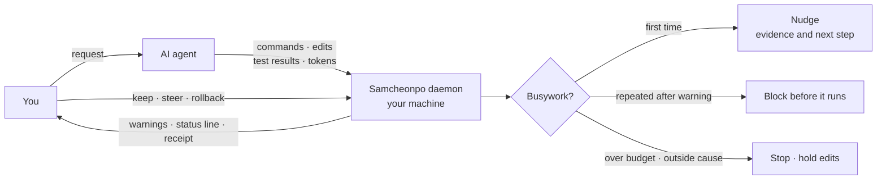
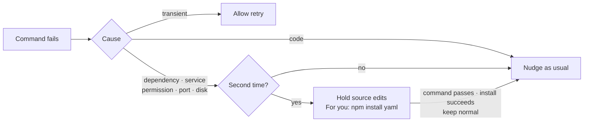
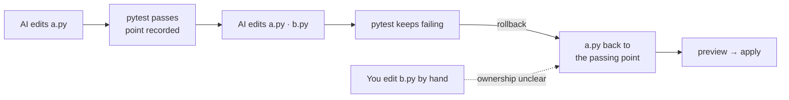

<div align="center">

<picture>
  <source media="(prefers-color-scheme: dark)" srcset="docs/assets/logo-dark.png">
  
</picture>

**A harness that notices when an AI coding agent is burning your time and money on busywork, tells you, and stops it**

[](https://github.com/JinHo-von-Choi/anti-samcheonpo/actions/workflows/ci.yml)
[](LICENSE)
[](https://go.dev/dl/)

[한국어](README.md) | English

</div>

---

## Why

An engineer notices right away when an agent reruns the same test again or starts editing files nobody asked for, and steps in. A non-engineer has no way to tell. Meanwhile the agent says it is "almost done" while time and usage limits drain away.

Busywork usually takes one of three shapes:

- **Verifying more than needed.** The code has not changed, yet the same tests run again and again.
- **Going the wrong way.** You asked for a login bug fix; it is rewriting the whole login flow.
- **Going in circles.** It repeats the same failure, or tries to fix with code what code cannot fix: a missing package, a server that is down.

Samcheonpo is a local tool that catches this busywork from actual execution results. The name comes from a Korean idiom: a conversation that wanders off "falls into Samcheonpo".

## How it works

Samcheonpo attaches to the agent's hooks and watches commands, file edits, test results and token usage. When the agent says "tests pass", only the actual result counts. Every decision is made on your machine, and no model is called.



At first it only nudges the agent, with evidence. If the agent gets the warning and still repeats the same busywork on the same target in the same session, the next call is **blocked before it runs** and the reason is returned. Blocks are capped at 3 per session, and `/samcheonpo:keep normal` lifts a wrong one.

You get warnings in plain language (shown in Korean by default):

```text
AI가 같은 시험을 4번 돌렸는데, 그 사이 코드는 한 글자도 바뀌지 않았습니다.
AI에게 이렇게 말해 보세요: "같은 시험을 다시 돌리지 말고, 직전 실패 원인을 먼저 찾아 줘."
[/samcheonpo:keep now 이번만 허용]  [/samcheonpo:keep normal 이 판정은 틀림]  [/samcheonpo:summary 멈추고 요약 받기]
```

> The AI ran the same test 4 times, and not a single character of code changed in between.
> Try telling the AI: "Stop rerunning the same test and find the cause of the last failure first."

The status line starts with the current state:

```text
[지켜보는 중] 진척 1/2 · 공회전 API환산 1,240원 · 헛짓 12% (계측분)
```

| State | Meaning |
| --- | --- |
| On track (순조로움) | There is evidence of progress, such as a passing check, and no warning since |
| Watching (지켜보는 중) | No evidence of progress yet, or a light advisory was given |
| Step in now (지금 끼어드세요) | Repeated busywork or a block |
| Unknown (확인 불가) | Observations are missing, so no judgment is possible |

> Amounts in won are **measured tokens converted at API prices**. They are not your actual bill or savings. When usage is unknown, it shows "unknown", not 0.

## What it catches

| Busywork | Examples | Response |
| --- | --- | --- |
| Over-verification | Same test with no code change, rerunning a 5-minute-plus full suite right after a few lines, starting a long load test without a short probe | Nudge → block on repeat |
| Drift | Editing files outside the request, editing protected paths, losing the goal after context compaction | Nudge; protected paths blocked at once; goal restated after compaction |
| Repeated failure | Same error after each fix, retrying a fix that already failed, edit-and-revert loops, patching browser-test timing, resubmitting to a checker that keeps rejecting for the same reason | Nudge → block on repeat → handoff |
| Outside-the-code problems | Missing dependency, service down, permissions, port in use | Hold source edits, tell you what a person must do |
| False completion | Deleting, skipping or weakening tests, hiding errors, claiming "done" while the done-check fails | Nudge → block on repeat |
| Release spamming | Re-releasing without reproducing a CI failure locally, rerunning a failed CI unchanged, too many releases per hour | Nudge → block on repeat, even with a new tag |
| Waiting after completion · stalled progress | Keeps waiting after completion checks pass, or changes input without reducing failures in the same check | Records only by default; light advice when enabled |
| Runaway cost | Spending without progress, over budget, very long sessions in time or tokens | Notice → confirm → stop at the ceiling |

Waiting and stalled-progress advice requires enough evidence to check the reason for waiting and the test results. These two rules never block work. See [waiting and stalled-progress advice](docs/spec/agenttime-reliability.md) (Korean) to enable them. These rules are included in v0.6.0; effects on cost and completion rate remain unverified.

### Problems outside the code

Some failures cannot be fixed by editing code. When the same command fails twice for the same outside cause with nothing in the environment changed, Samcheonpo holds source edits until that cause is gone and tells you the command a person needs to run.



Dependency manifests (`package.json`, `requirements.txt`, `go.mod`, ...) stay editable during a hold. Timeouts and forced kills can be code problems, so they never trigger a hold.

### Principles

1. **Judge by results.** Execution results and the working tree count, not the agent's own report.
2. **Count alone never blocks.** Only when input and environment are unchanged and nothing new was learned. A retry after a code change is not blocked.
3. **Every block comes with a reason.** Evidence and the next step are returned together.
4. **Unknown stays unknown.** Missing measurements show as unknown; estimates are labeled as estimates.
5. **Records stay on your machine.** Remote sending and external judge models stay off until you turn them on.

---

## Install

### Release archive

Download `samcheonpo_<version>_<os>_<arch>.tar.gz` and `SHA256SUMS` from [Releases](https://github.com/JinHo-von-Choi/anti-samcheonpo/releases). Archives exist for linux, darwin and windows on amd64 and arm64.

```bash
sha256sum -c --ignore-missing SHA256SUMS   # macOS: shasum -a 256 -c --ignore-missing SHA256SUMS
tar -xzf samcheonpo_0.7.0_linux_amd64.tar.gz
mkdir -p ~/.local/bin && cp samcheonpo samcheonpo-hook ~/.local/bin/
samcheonpo doctor
```

Keep `samcheonpo` and the hook helper `samcheonpo-hook` in the same folder. On Windows, extract the same way, put both `.exe` files in one folder on PATH, and install Git for Windows.

### From source

Requires Go 1.27 or later.

```bash
go install github.com/JinHo-von-Choi/anti-samcheonpo/cmd/samcheonpo@v0.7.0
go install github.com/JinHo-von-Choi/anti-samcheonpo/cmd/samcheonpo-hook@v0.7.0
```

## Quick start

**1. See where your tokens went in the last 30 days.** It changes nothing and calls no model.

```bash
samcheonpo audit --since 30d
```

```text
계측된 토큰               26871.5M토큰
  진척 (추정)              3423.1M토큰    13%
  필요한 탐색             13523.5M토큰    50%
  헛짓                      770.3M토큰     3%
실시간이었다면 개입 1418회
헛짓 상위 세션
  3f2a91c0  09-08 10:10     26.7M토큰  헛짓  18%  결제 화면 오류 고쳐 줘
```

The lines are: measured tokens, estimated progress, necessary exploration, busywork, how many times it would have stepped in live, and the sessions with the most busywork. Use `samcheonpo receipt <session-id>` for one session in detail.

**2. Connect your agent.**

```bash
samcheonpo install --agent claude     # Claude Code (plugin, status line)
samcheonpo install --agent codex      # Codex
samcheonpo install --agent opencode   # opencode
samcheonpo install --agent agy        # Antigravity CLI
samcheonpo install --agent hermes     # Hermes
samcheonpo install --agent openclaw   # OpenClaw
```

Existing hooks and status line settings are kept. It applies from the next agent session, and the daemon starts on the first hook call.

**3. Work as usual.** Answer warnings with these commands (Claude Code):

| Command | What it does |
| --- | --- |
| `/samcheonpo:summary` | What you asked, what it is doing, what is done, what is stuck, what it cost |
| `/samcheonpo:keep normal` | Record that the last call was wrong; the same target is not blocked again within the same goal |
| `/samcheonpo:keep now` | Allow it this once; if it happens again, advise before blocking |
| `/samcheonpo:steer` | Pass Samcheonpo's prescription to the agent |
| `/samcheonpo:check` | Run the done-check now |
| `/samcheonpo:rollback` | Return files the AI changed to the last passing check |
| `/samcheonpo:extend 2h` | Raise the session ceiling. Time as `2h`, `30m`; tokens as `20M`, `500K` |
| `/samcheonpo:accept`, `/samcheonpo:edit` | Accept or edit a work contract |

With other agents, run `samcheonpo cmd <command>` in a terminal. `keep`, `accept`, `extend` and `rollback apply` are for you only; the agent's shell is refused.

**4. Disconnect.**

```bash
samcheonpo uninstall --agent claude
```

This restores the pre-install state. Files you changed and the records are kept.

## Rollback

At every passing check, Samcheonpo records the AI's files under `.samcheonpo/snapshots`. When things go wrong you can go back to that point, even after the daemon restarts.



**Only files the AI changed with its write tools, and nobody touched since, are restored.** Files you edited, files changed by shell commands and links are left alone, with the reason shown in the preview. Previous contents are backed up under `~/.samcheonpo/backup/`.

| Command | Restores to |
| --- | --- |
| `/samcheonpo:rollback` → `apply <plan-id>` | The last passing check in this session |
| `/samcheonpo:rollback golden` → `golden <id>` → `golden <id> apply <plan-id>` | One of the recorded passing points (latest 5) |

## Work contract (optional)

By default Samcheonpo only observes. To have it check completion itself, write a work contract.

```yaml
# .samcheonpo/contract.yml
goal: Send the user to the re-login screen when the session expires
done:
  - check: "pytest -q tests/test_session.py"   # Samcheonpo runs this itself
scope:
  allow: ["src/auth/**", "tests/**"]
  protect: ["migrations/**"]                   # edits blocked at once
budget: {krw: 5000, minutes: 40}               # stops when exceeded
```

After you accept it with `/samcheonpo:accept`, progress is measured by the done-checks, protected paths are enforced, and work stops over budget. The acceptance record is signed with a key in your home directory, so a record written by the agent is not accepted. Any change to the contract needs a new acceptance. To have the agent draft a contract for every task, set `contract: {draft: on}` in `.samcheonpo.yml`.

## Configuration

User settings live in `~/.samcheonpo/config.yml`, project settings in `.samcheonpo.yml`.

```yaml
rollout:
  mode: recommend            # shadow: record only | recommend: nudge, eligible rules may block on repeat
  escalate_max_blocks: 3     # escalation cap; explicit protection and budgets are separate
  recommend_rules: []        # opt into waiting/stall advice in the user config only
contract:
  draft: off                 # on: ask for a contract draft for every task
notify:
  desktop: true
swarm:
  tree_krw: 0                # budget (KRW) shared by parent and child sessions; 0 = none
detectors:
  s8_cost:
    notice_hours: 2          # active-time notice
    warn_hours: 4            # ask whether to continue
    ceiling_hours: 0         # past this only reads are allowed; 0 = none
    ceiling_tokens: 0        # the same ceiling in tokens
  s1_verify_treadmill:
    expensive_check_sec: 300 # rerunning a test that took longer than this after a small change is flagged
  s5_release:
    releases_per_hour: 2
```

- Waiting (`s1.explicit_waiting`) and stalled progress (`s8.progress_stall`) record observations without advice by default. To receive advice, add either rule to `rollout.recommend_rules` in your user settings. Rules still named in the record-only `shadow_rules` list stay silent. These two rules provide light advice (L1) at most.
- Active time excludes gaps longer than 30 minutes between events. A contract's `budget.minutes` is enforced as the same ceiling.
- Project settings can only **loosen** user settings. Block caps, budgets and ceilings can only go down; remote sending, notification targets and external programs can only be turned off.
- Parent and child sessions are grouped only when linked with `samcheonpo handoff link` or when the agent sends a parent session ID.

## Support

| Agent | Support | Hook payloads verified on |
| --- | --- | --- |
| Claude Code | Observe · nudge · block before run · status line · slash commands | 2.1.x |
| Codex | Observe · nudge · block before run | 0.160–0.162 |
| opencode | Observe · nudge · block before run | 1.18.x |
| Antigravity (agy) | Observe · nudge · block before run | 1.3.x |
| Hermes | Observe · nudge · block before run | 0.21.x |
| OpenClaw | Observe · nudge (from the next request) · block before run | 2026.7.x |
| GitHub Copilot · Cursor | Observe | |

An agent update alone never switches intervention off. As long as hook payloads still carry the session, tool name, call ID, tool input and result, it keeps intervening. If a payload arrives in a different shape, that agent drops to observe-only, and the status line and `samcheonpo doctor` say why.

Linux, macOS and Windows 10 1803 or later are supported. On Windows, checks run through Git for Windows' bash. See [Support](docs/support-matrix.md) for what is verified on each platform.

## Limitations

- **The effect is still being measured.** The samples are small, so no general savings rate is claimed. See the [experiment protocol](docs/benchmarks/protocol-v1.md).
- **False positives can happen.** That is why it nudges first and blocks only when a warning is ignored, within a per-session cap. Report wrong calls with `/samcheonpo:keep normal`.
- **A block before run needs the decision within 15 ms.** If it takes longer, the call is not blocked and the status line shows `Unknown`.
- **Rollback covers only files with confirmed ownership.** Files changed by shell commands, files mixed with human edits, and files written by another session's agent are excluded.
- **Isolation of user-only commands is not complete.** They are refused from the agent's shell, but a process running as the same OS user can still talk to the daemon directly.
- **Short, clear tasks give it little to do.** Busywork mostly happens in long, complex sessions.

## Learn more

- [Getting started](docs/getting-started.md) (Korean): from install to day-to-day rules
- [Support](docs/support-matrix.md) (Korean): what is verified per platform and agent
- [Agent guide](plugins/claude-code/skills/samcheonpo/SKILL.md) (Korean): how an agent sets up Samcheonpo and responds to warnings. Installed with the Claude Code plugin
- Specs: [progress contract](docs/spec/progress-contract-v1.md) · [evidence ledger](docs/spec/evidence-ledger-v1.md) · [receipt display](docs/spec/receipt-billing.md) · [recovery](docs/spec/recovery-v1.md) · [handoff](docs/spec/handoff-v1-draft.md) · [waiting/stall advice and record evaluation](docs/spec/agenttime-reliability.md)
- Evaluation: `samcheonpo bench`, `samcheonpo bench ab`, `samcheonpo gaps`, `samcheonpo interventions`, `samcheonpo eval corpus` (current working tree)
- [Conformance cases](conformance/): tests for scoring other implementations against the same spec

## License

[MIT](LICENSE)

---

<p align="center">
  Made by <a href="mailto:jinho.von.choi@nerdvana.kr">Jinho Choi</a> &nbsp;|&nbsp;
  <a href="https://buymeacoffee.com/jinho.von.choi">Buy me a coffee</a>
</p>

`samcheonpo report --since 30d --mode live` compares agent observations, separating live sessions from audits. Missing prices use token ratios and show price coverage; unknown usage is not zero cost. Activity classifications and checkpoint observations do not certify completion. `samcheonpo interventions --by-agent` also lists reasons why an outcome could not be observed. A window without relevant actions does not establish absence of recurrence.

The v0.7.0 ledger schema 9 separates daemon observation closure from actual session termination. Legacy records retain their timestamps and seals, with unknown closure evidence. Back up the ledger before upgrading: v0.6.0 cannot open schema 9.
