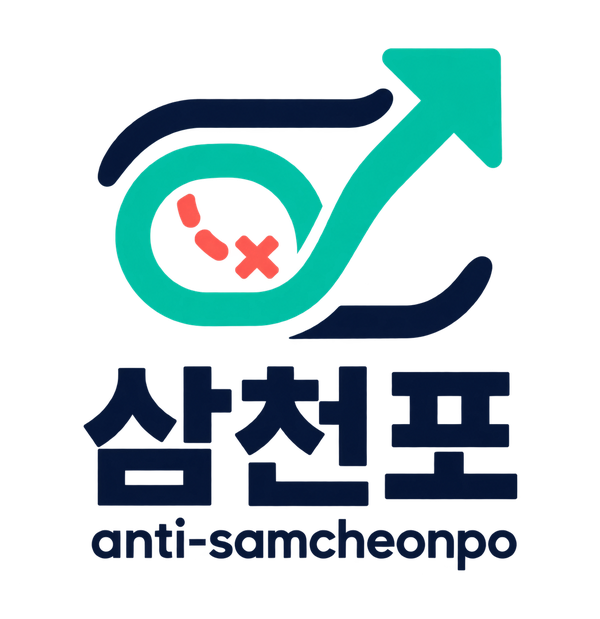
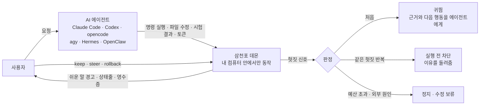
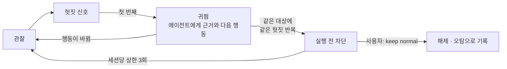
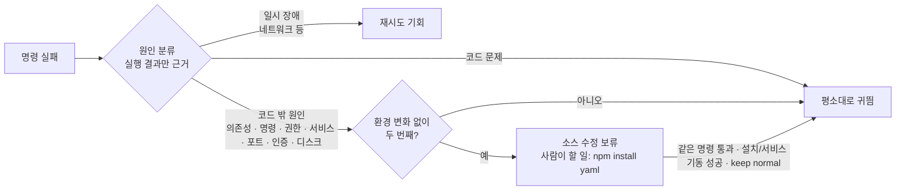
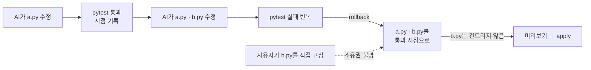

<div align="center">

<picture>
  <source media="(prefers-color-scheme: dark)" srcset="docs/assets/logo-dark.png">
  
</picture>

**AI 코딩 에이전트가 헛짓에 시간과 돈을 태우는 것을 알아채고, 알려 주고, 멈추게 하는 하네스**

[](https://github.com/JinHo-von-Choi/anti-samcheonpo/actions/workflows/ci.yml)
[](LICENSE)
[](https://go.dev/dl/)

한국어 | [English](README.en.md)

</div>

---

## 왜 만들었나

AI에게 코딩을 시킬 때 개발자와 비개발자의 가장 큰 차이는 **AI가 지금 헛짓을 하고 있는지 알아보는 눈**입니다. 개발자는 화면을 보다가 "또 같은 걸 돌리네", "이건 시킨 일이 아닌데" 하고 끼어듭니다. 비개발자에게는 그 순간을 알아볼 기준이 없습니다.

그래서 이런 일이 생깁니다.

- **필요 이상의 검증.** 결과물은 그대로인데 같은 시험을 몇 번이고 다시 돌리며 토큰을 태우다 사용 한도가 바닥납니다.
- **엉뚱한 방향.** 로그인 오류를 고쳐 달라고 했는데 어느새 로그인 방식 전체를 갈아엎고 있습니다.
- **같은 자리에서 맴돌기.** 감당하지 못하는 문제 앞에서 간단한 작업도 계속 실패합니다. 설치되지 않은 패키지, 꺼져 있는 서버처럼 코드로 풀 수 없는 문제를 코드로 풀려고 덤벼들기도 합니다.

AI는 그동안 "거의 다 됐습니다"라고 말합니다. 사용자는 모른 채 지켜보다가 시간과 돈을 잃습니다. 삼천포는 이 **멍청비용**을 줄이려고 만든 도구입니다. 이야기가 엉뚱한 데로 새는 것을 "삼천포로 빠진다"고 하듯, 작업이 삼천포로 빠지는 순간을 잡습니다.

## 한눈에 보기

삼천포는 에이전트와 사용자 사이에 서서 실제 실행 결과만 보고 판단합니다. AI의 말은 근거가 아닙니다.



## 어떻게 돕는가

**1. 지켜봅니다.** 에이전트의 훅에 붙어 실행하는 명령, 고치는 파일, 시험 결과, 쓰는 토큰을 실시간으로 봅니다. AI가 "통과했다"고 말해도 실제 실행 결과로만 판단합니다.

**2. 쉬운 말로 알려 줍니다.** "identical rerun detected" 대신 이렇게 말합니다.

```text
AI가 같은 시험을 4번 돌렸는데, 그 사이 코드는 한 글자도 바뀌지 않았습니다.
코드 밖 조건(설치되지 않은 의존성) 때문일 가능성이 높은 실패로 같은 명령이 2번 실패했습니다.
AI가 요청 범위 밖 파일을 고쳤습니다 (src/theme/dark.css, 누적 2개).
```

경고마다 AI에게 그대로 붙여 넣을 수 있는 한 문장과 선택지가 따라옵니다.

```text
AI에게 이렇게 말해 보세요: "src/theme/dark.css는 내가 부탁한 범위가 아니야. 꼭 필요한 변경이면 이유를 먼저 설명하고, 아니면 되돌려 줘."
[/samcheonpo:keep now 이번만 허용]  [/samcheonpo:keep normal 이 판정은 틀림]  [/samcheonpo:steer 방향 바꾸라고 하기]  [/samcheonpo:summary 멈추고 요약 받기]
```

상태줄 맨 앞에는 지금 상태가 네 가지 중 하나로 보입니다. 경고가 없다는 것만으로 순조롭다고 표시하지 않습니다.

| 상태 | 뜻 |
| --- | --- |
| 순조로움 | 검사 통과 같은 진척 근거가 있고, 그 뒤 경고가 없다 |
| 지켜보는 중 | 아직 진척 근거가 없거나, 가벼운 안내가 한 번 있었다 |
| 지금 끼어드세요 | 반복된 헛짓이나 차단이 있다 |
| 확인 불가 | 관측이 빠져 판단할 수 없다 |

```text
[지켜보는 중] 진척 1/2 · 공회전 API환산 1,240원 · 헛짓 12% (계측분)
```

**3. 무시하면 막습니다.** 처음에는 근거와 함께 귀띔만 합니다. 같은 세션에서 같은 경고를 받고도 같은 대상에 같은 헛짓을 반복하면, 그다음 실행을 **실행 전에** 막고 이유를 돌려줍니다. 잘못 막았다면 `/samcheonpo:keep normal` 한 번으로 풀립니다.



**4. 지난 일을 돌아보게 합니다.** `samcheonpo audit`는 지난 Claude Code·Codex 기록을 읽어 토큰이 진척·필요한 탐색·헛짓 중 어디에 쓰였는지 영수증으로 보여 줍니다. 모델을 호출하지 않고, 기록은 내 컴퓨터를 떠나지 않습니다.

> 삼천포가 보여 주는 원화는 **계측된 토큰을 API 단가로 환산한 금액**입니다. 실제 청구액이나 절감액이 아닙니다. 사용량을 알 수 없으면 0원이 아니라 "미확인"으로 표시합니다.

---

## 무엇을 잡나

| 멍청비용 | 삼천포가 보는 신호 | 개입 |
| --- | --- | --- |
| **과잉 검증** | 코드 변경 없이 같은 시험 반복 · 이미 통과한 근거가 있는 검사 재실행 · 문서만 바꾸고 재검증 · 같은 상태에서 같은 리뷰 반복 · 몇 줄 고치고 오래 걸리는 전체 시험을 바로 재실행(실제로 5분 넘게 걸린 시험만, 실행 스크립트로 감싸도 같은 시험으로 인식) · 짧은 확인 없이 긴 부하·장시간 시험 시작 | 귀띔 → 반복 시 실행 전 차단(이전 결과 제시) |
| **맥락 이탈** | 요청 범위 밖 파일 수정 · 보호 경로 수정 · 실제 서비스를 가짜로 바꿔 시험 통과 · 맥락 압축 뒤 이전 목표로 회귀 | 귀띔 · 보호 경로는 즉시 차단 · 요청한 일과 지금 하는 일을 나란히 표시 · 맥락 압축 직후 한 번, 목표·보호 경로·남은 완료 조건을 한 줄로 다시 알려 줌 |
| **능력 부족 루프** | 고쳐도 같은 오류 반복(출력을 로그로 보내거나 `tail`로 종료 코드를 가려도) · 같은 파일만 고치다 실패 · 이미 실패한 수정을 다시 시도(세션이 바뀌어도) · 고쳤다 되돌리기 반복(이름·공백만 바꾼 것 포함) · 코드 밖 조건 때문일 가능성이 높은 반복 실패 · 외부 검사 도구가 고쳐도 같은 이유로 거부 · 브라우저 시험의 타이밍 실패를 문구·대기 시간만 바꿔 땜질 · 분석 보고서 항목을 하나씩 처리 | 귀띔 → 반복 시 차단 → 자동 재시도 중단과 인수인계 문서. 코드 밖 원인이 확인되면 아래 "코드 밖 문제" 절대로 처리 |
| **허위 완료** | 시험 삭제·skip·단언 약화 · 오류를 숨기는 코드 · 완료 조건이 실패한 채 "완료" 선언 | 귀띔 → 반복 시 차단 |
| **비용 폭주** | 진척 없이 쌓이는 지출 · 비정상적인 지출 속도 · 설정한 예산 초과 · 부모·자식 세션을 합한 군집 지출 초과 · 세션 활동 시간·토큰(2시간·1천만 알림, 4시간·3천만 확인) | 알림 · 예산 초과 시 정지 · 군집 한도를 넘으면 그 나무의 모든 세션을 실행 전에 거부 · 세션 상한을 정해 두면 넘는 순간 읽기만 허용하고 `/samcheonpo:extend`로만 연장 |
| **배포 연타** | 원격 CI 실패를 로컬에서 재현하지 않고 다시 배포(실패한 시험이 통과하거나 전체 검사가 통과해야 재현으로 봄) · 직전 배포 뒤 고친 내용을 검사하지 않고 배포 · 브라우저 시험이 타이밍으로 실패한 채 배포 · 시간당 배포 횟수 초과 | 귀띔 → 태그가 바뀌어도 같은 판정으로 보고 반복 시 실행 전 차단 |

### 코드 밖 문제는 코드로 풀 수 없습니다

설치되지 않은 패키지, 꺼져 있는 서버, 권한, 포트 점유 같은 문제는 코드를 아무리 고쳐도 풀리지 않습니다. 같은 명령이 환경 변화 없이 같은 외부 원인으로 두 번 실패하면, 삼천포는 그 원인이 풀릴 때까지 소스 수정을 실행 전에 보류하고 사람이 실행할 명령 한 줄을 알려 줍니다.



의존성 선언 파일(`package.json`, `requirements.txt` 등)은 보류 중에도 고칠 수 있습니다. 시간 초과나 강제 종료는 코드 원인일 수 있어 보류하지 않습니다.

### 판단 원칙

1. **결과로 판단한다.** AI의 자기 보고가 아니라 실행 결과·작업 폴더 상태·시험 결과로 판단합니다.
2. **횟수만으로 막지 않는다.** 입력과 환경이 그대로이고 새 정보도 진척도 없을 때만 막습니다. 코드를 바꾼 재시도는 막지 않습니다. 코드 밖 원인으로 실패한 뒤의 재실행 한 번은 회복 확인으로 통과시키고, 설치나 서비스 기동 명령이 사이에 있으면 반복을 새로 셉니다.
3. **막을 때는 이유를 준다.** 무엇을 근거로, 무엇을 하면 되는지 함께 돌려줍니다. 실행 결과를 흉내 낸 가짜 출력은 만들지 않습니다.
4. **모르는 것은 모른다고 한다.** 계측이 빠지면 0원이 아니라 미확인, 추정은 추정이라고 표시합니다.
5. **기록은 내 컴퓨터에 둔다.** 원격 전송이나 외부 판정 모델은 사용자가 명시적으로 켜기 전에는 쓰지 않습니다.

---

## 설치

### 릴리스 파일

[Releases](https://github.com/JinHo-von-Choi/anti-samcheonpo/releases)에서 환경에 맞는 `samcheonpo_0.5.2_<OS>_<아키텍처>.tar.gz`와 `SHA256SUMS`를 받습니다. 제공 파일은 linux·darwin·windows의 amd64와 arm64입니다. 파일마다 GitHub Actions의 같은 종류 러너에서 만들고 키 없는 설치·제거·감사·첫 훅 확인을 통과시켰습니다.

```bash
sha256sum -c --ignore-missing SHA256SUMS   # macOS는 shasum -a 256 -c
tar -xzf samcheonpo_0.5.2_linux_amd64.tar.gz
mkdir -p ~/.local/bin && cp samcheonpo samcheonpo-hook ~/.local/bin/
samcheonpo doctor
```

Windows는 같은 `tar -xzf`로 풀고 `samcheonpo.exe`와 `samcheonpo-hook.exe`를 PATH의 같은 폴더에 둡니다(Git for Windows 필요).

두 실행 파일(`samcheonpo`, 가벼운 훅용 `samcheonpo-hook`)은 같은 폴더에 둡니다.

### 소스에서 설치

Go 1.27 이상이 필요합니다. 실제 에이전트 실행을 확인한 환경은 Linux x86-64뿐이며, macOS와 Windows의 확인 범위는 아래 지원 범위 표에 있습니다.

```bash
go install github.com/JinHo-von-Choi/anti-samcheonpo/cmd/samcheonpo@v0.5.2
go install github.com/JinHo-von-Choi/anti-samcheonpo/cmd/samcheonpo-hook@v0.5.2
```

Windows는 Windows 10 1803 이상과 Git for Windows가 필요합니다. 전체 시험·적합성·훅 지연·릴리스 후보 smoke는 Windows 11 arm64에서 통과했고, Claude Code 실제 세션에서 훅 발화·반복 탐지·실행 전 차단까지 확인했고, 다른 에이전트는 아직 확인하지 않았습니다.

---

## 빠른 시작

**1. 지난 30일에 토큰이 어디로 갔는지 봅니다.** 설치 직후 바로 해 볼 수 있고, 아무것도 바꾸지 않습니다.

```bash
samcheonpo audit --since 30d
```

```text
계측된 토큰               26871.5M토큰
  진척 (추정)              3423.1M토큰    13%
  필요한 탐색             13523.5M토큰    50%
  헛짓                      770.3M토큰     3%
실시간이었다면 개입 1418회
헛짓 상위 세션
  3f2a91c0  09-08 10:10     26.7M토큰  헛짓  18%  결제 화면 오류 고쳐 줘
```

세션 하나를 자세히 보려면 `samcheonpo receipt <세션>`을 씁니다.

**2. 에이전트에 연결합니다.**

```bash
samcheonpo install --agent claude     # Claude Code (플러그인과 상태줄)
samcheonpo install --agent codex      # Codex
samcheonpo install --agent opencode   # opencode
samcheonpo install --agent agy        # Antigravity CLI (~/.gemini/config/hooks.json)
samcheonpo install --agent hermes     # Hermes (플러그인, hermes plugins enable)
samcheonpo install --agent openclaw   # OpenClaw (플러그인, openclaw plugins install)
```

기존 훅과 상태줄 설정은 보존됩니다. 이제 평소처럼 AI에게 일을 시키면 됩니다. 처음 훅이 불릴 때 백그라운드 데몬이 자동으로 뜹니다.

**3. 작업 중에 쓰는 명령 (Claude Code)**

| 명령 | 하는 일 |
| --- | --- |
| `/samcheonpo:summary` | 요청한 일, 지금 하는 일, 끝난 것, 막힌 것, 쓴 돈을 평문으로 요약 |
| `/samcheonpo:keep normal` | 방금 판정이 틀렸다고 알림. 지금 작업 목표 안에서 같은 대상의 같은 판정은 다시 막지 않음(보호 경로·예산은 그대로) |
| `/samcheonpo:keep now` | 이번만 넘어감. 다시 생기면 막기 전에 먼저 안내 |
| `/samcheonpo:steer` | 삼천포의 처방을 에이전트에게 전달 |
| `/samcheonpo:check` | 완료 조건을 지금 검사 |
| `/samcheonpo:rollback` | AI가 쓰기 도구로 바꾼 파일을 마지막 진척 시점(검사 통과)으로 되돌리기. 인자 없이는 미리보기, `apply <계획 ID>`로 미리본 그대로 실행 |
| `/samcheonpo:rollback golden` | 검사가 통과한 시점마다 기록해 둔 AI 파일의 목록. `golden <id>`로 미리보기, `golden <id> apply <계획 ID>`로 실행. 최근 5개 시점을 보관 |
| `/samcheonpo:extend 2h` | 정해 둔 세션 상한을 늘림. 시간은 `2h`·`30m`, 토큰은 대문자 `20M`·`500K` |
| `/samcheonpo:accept`, `/samcheonpo:edit` | 작업 계약 수락·수정 (계약을 쓸 때) |

`/samcheonpo:summary` 예시:

```text
요청한 일: "src/auth/session.py 만료 처리 고쳐 줘"
지금 하는 일: 최근에 src/theme/dark.css, src/auth/session.py를 바꿨다, 마지막 명령은 `pytest -q`.
요청 범위 밖으로 보이는 변경: src/theme/dark.css. 의도한 변경이 아니라면 방향을 다시 알려 주면 된다.
끝난 것: 아직 확인된 진척이 없다.
```

**4. 연결을 해제합니다.**

```bash
samcheonpo uninstall --agent claude
```

설치 전 상태로 되돌리며, 사용자가 직접 고친 파일은 지우지 않습니다.

---

## 되돌리기

AI가 바꾼 파일을 마지막으로 검사가 통과한 시점으로 되돌립니다. 검사가 통과할 때마다 그 시점의 AI 파일을 `.samcheonpo/snapshots`에 기록해 두므로, 데몬이 다시 시작된 뒤에도 그 시점으로 돌아갈 수 있습니다.



규칙은 하나입니다. **AI가 쓰기 도구로 바꿨고 그 뒤 아무도 손대지 않은 파일만 되돌립니다.** 사람이 편집한 파일, 셸 명령으로 바뀐 파일, 링크는 대상이 아니며 미리보기에 이유와 함께 표시됩니다. 바꾸기 전 내용은 `~/.samcheonpo/backup/`에 백업됩니다.

---

## 작업 계약 (선택)

기본은 **관찰 전용**입니다. 에이전트에게 추가 일을 시키지 않고 지켜보기만 합니다. "무엇이 끝나야 완료인가"를 삼천포가 직접 확인하게 하려면 작업 계약을 씁니다.

```yaml
# .samcheonpo/contract.yml
goal: 로그인 세션 만료 시 재로그인 화면으로 보낸다
done:
  - check: "pytest -q tests/test_session.py"
scope:
  allow: ["src/auth/**", "tests/**"]
  protect: ["migrations/**"]
budget: {krw: 5000, minutes: 40}
```

`/samcheonpo:accept`로 수락하면 삼천포가 완료 조건 검사를 직접 실행해 진척을 재고, 보호 경로 수정은 막고, 예산을 넘으면 멈춥니다. 매 작업마다 에이전트가 초안을 쓰게 하려면 `.samcheonpo.yml`에 `contract: {draft: on}`을 둡니다.

수락한 뒤 계약 파일의 항목을 하나라도 바꾸면(목표 포함) 다시 수락해야 합니다. 수락 기록은 사용자 홈의 키로 서명하므로, 에이전트가 직접 쓰거나 다른 프로젝트에서 복사한 기록은 수락으로 인정하지 않습니다.

## 설정 (`.samcheonpo.yml`, `~/.samcheonpo/config.yml`)

```yaml
rollout:
  mode: recommend            # shadow(기록만) | recommend(귀띔, 무시하면 차단) | validated
  escalate_max_blocks: 3     # 세션당 차단 상한, 0이면 차단하지 않음
contract:
  draft: off                 # on이면 새 작업마다 계약 초안을 요청
notify:
  desktop: true
swarm:
  tree_krw: 0                # 부모·자식 세션을 합한 군집 예산(원). 0이면 계약 예산만 적용
detectors:
  s8_cost:
    notice_hours: 2          # 세션 활동 시간 알림(상태줄). 0이면 끔
    warn_hours: 4            # 계속할지 사용자에게 확인
    ceiling_hours: 0         # 넘으면 읽기만 허용, /samcheonpo:extend로 연장. 0이면 없음
    ceiling_tokens: 0        # 같은 상한을 토큰(입력·출력·캐시 쓰기)으로
  s1_verify_treadmill:
    expensive_check_sec: 300 # 이보다 오래 걸린 시험을 작은 변경 뒤 바로 재실행하면 판정
  s5_release:
    releases_per_hour: 2
```

계약의 `budget.minutes`도 세션 상한(활동 시간)으로 집행합니다. 활동 시간은 이벤트 사이 공백이 30분을 넘는 구간(자리를 비운 시간)을 빼고 셉니다.

군집은 `samcheonpo handoff link`로 이은 세션이나, 플러그인이 세션 시작 때 `parent_session_id`를 보낸 세션만 묶습니다. 계보를 모르는 세션은 혼자인 나무로 두고 막지 않습니다.

프로젝트 설정은 사용자 설정보다 **약하게만** 바꿀 수 있습니다. 탐지 기준을 더 엄격하게 하거나 차단 상한을 올릴 수 없고, 군집 예산을 늘릴 수 없고, 외부 전송·알림 목적지·실행할 외부 프로그램을 추가하거나 바꿀 수 없으며 끄기만 할 수 있습니다. 오탐률을 재지 않은 새 규칙은 기록만 하는 `shadow_rules`에서 시작합니다. 장시간 세션 규칙(전체 시험 재실행, 장시간 실행, 배포 연타, 반복 거부, 브라우저 타이밍, 보고서 처리, 세션 길이)은 기존 오탐 방지 시나리오와 실제 42시간 Codex 세션 기록 재생으로 확인한 뒤 귀띔 단계에서 시작합니다.

연구용 실험 모드(`experiment: {enabled: true}`)는 기본으로 꺼져 있습니다. 켜면 일부 안내를 대조군으로 보류해 전달하지 않으며, 상태줄에 그 사실을 표시합니다. 프로젝트 설정으로는 켤 수 없습니다.

## 지원 범위

| 에이전트 | 지원 | 확인한 버전 |
| --- | --- | --- |
| Claude Code | 관찰 · 귀띔 · 실행 전 차단 · 상태줄 · 슬래시 명령 | 2.1.x |
| Codex | 관찰 · 귀띔 · 실행 전 차단 | 0.160.x–0.162.x |
| opencode | 관찰 · 귀띔 · 실행 전 차단 | 1.18.x |
| Antigravity(agy) | 관찰 · 귀띔 · 실행 전 차단 | 1.3.x |
| Hermes | 관찰 · 귀띔 · 실행 전 차단 | 0.21.x |
| OpenClaw | 관찰 · 귀띔(다음 요청부터) · 실행 전 차단 | 2026.7.x |
| GitHub Copilot · Cursor | 관찰 전용 | |

"확인한 버전"은 훅 입력을 실제로 수집해 시험에 넣은 범위입니다. 그 밖의 버전이라고 개입을 끄지는 않습니다. 에이전트가 업데이트돼도 들어오는 훅 입력에 세션·도구 이름·호출 ID·도구 입력(셸 명령, 파일 경로, 패치)·결과가 그대로 있으면 귀띔과 차단을 계속합니다. 형식이 실제로 달라진 입력이 한 번이라도 오면 그때부터 그 에이전트는 관찰만 하고, 상태줄과 `samcheonpo doctor`에 이유를 표시합니다.

- agy: 훅이 도구 결과를 주지 않아 대화 기록에서 종료 코드·출력·토큰을 읽습니다. 셸 결과는 다음 이벤트에서 반영됩니다. 세션 종료 이벤트가 없어 종료 영수증은 만들지 않습니다.
- OpenClaw: 실행 중에 도구 결과를 바꿔 모델에 보여 줄 훅이 없습니다. 귀띔은 다음 요청에 붙고, 그 전에는 같은 실행 안의 반복을 막지 않습니다.

| 환경 | 상태 |
| --- | --- |
| Linux x86-64 | 실제 설치·제거·훅 지연(p95 10ms 이내)·실제 에이전트 실행 확인 |
| macOS | 소스 설치. GitHub Actions의 macOS 러너에서 데몬·훅·되돌리기를 포함한 전체 시험과 적합성 사례 통과. 실제 에이전트 실행은 미확인 |
| Linux arm64 | 소스 설치 가능, 실제 실행 미확인 |
| Windows | 소스 설치. Windows 11 arm64에서 전체 시험, 적합성 17건, 훅 지연(200회 응답 200), 릴리스 후보의 설치·제거·감사·첫 훅 smoke 통과. Claude Code 실제 세션(훅 발화·반복 탐지·실행 전 차단)과 CI의 x64는 확인했고, 다른 에이전트는 미확인. 검사 명령은 Git for Windows의 bash로 실행 |
| WSL | Linux 실행 파일로 미확인 |

---

## 한계

- **효과는 아직 입증 중입니다.** 예비 실험에서 헛도는 과제의 완료당 비용이 줄어든 사례는 있지만, 표본이 작아 일반적인 절감률을 주장하지 않습니다. 2026-10-07 실제 Claude Code(Sonnet) 6과제 파일럿에서는 하네스 유무와 관계없이 6/6을 완료했고 개입은 0건이었습니다. 과제가 현재 모델에서 헛돌지 않아 효과를 측정하지 못했습니다. 실험 방법과 한계는 [실험 프로토콜](docs/benchmarks/protocol-v1.md)에 있습니다.
- **오탐이 있을 수 있습니다.** 그래서 처음에는 귀띔만 하고, 차단은 같은 세션의 같은 대상에서 경고를 무시했을 때만, 세션당 상한 안에서 합니다. 틀린 판정은 `/samcheonpo:keep normal`로 알려 주세요.
- **실행 전 차단은 훅이 기다리는 시간(15ms) 안에 판정이 끝나야 전달됩니다.** 넘기면 실행을 막지 않고, 상태줄에 판정 시간 초과 건수와 `확인 불가`를 표시합니다.
- **되돌리기는 쓰기 도구(Write·Edit)로 바뀐 파일 중 소유권이 확인된 것만 다룹니다.** 셸 명령으로 바뀐 파일, 사람 편집이 섞인 파일, 링크는 대상이 아닙니다. 기록된 통과 시점(`rollback golden`)으로 돌아갈 때도 같습니다. 다른 세션의 AI가 쓴 파일은 이 세션이 소유권을 확인할 수 없어 건드리지 않습니다.
- **코드 밖 원인에 따른 수정 보류는 오판일 수 있습니다.** 같은 명령이 환경 변화 없이 2번 같은 외부 원인으로 실패했을 때만 걸고, `/samcheonpo:keep normal`로 바로 풀 수 있습니다. 시간 초과(124)나 강제 종료(137)는 코드 원인일 수 있어 보류하지 않습니다.
- **코드 밖 원인 보류와 통과 시점 기록은 실제 Claude Code로 각 1회 확인했고, 군집 예산·압축 뒤 앵커·HUD는 하네스 시험으로만 확인했습니다.** 확인한 범위와 못 한 범위는 [지원·검증 범위](docs/support-matrix.md)에 있습니다.
- **사용자 전용 명령은 에이전트 셸에서 막지만 완전한 격리는 아닙니다.** `accept`·`keep`·`rollback apply`를 에이전트의 셸 도구로 실행하면 거부합니다. 같은 OS 사용자로 도는 프로세스가 데몬 소켓에 직접 접속하는 것까지 막지는 않습니다.
- **짧고 명확한 작업에서는 할 일이 거의 없습니다.** 헛짓은 대개 길고 복잡한 세션에서 생깁니다.
- **원화는 API 환산액입니다.** 구독 요금제의 실제 청구액이나 남은 한도를 뜻하지 않습니다.
- **에이전트의 훅 규격이 바뀌면** 일부 신호를 놓칠 수 있습니다. `samcheonpo doctor`로 연결 상태를 확인할 수 있습니다.

## 더 알아보기

- [처음 사용하기](docs/getting-started.md) · [지원·검증 범위](docs/support-matrix.md) · [에이전트용 사용 지침(스킬)](plugins/claude-code/skills/samcheonpo/SKILL.md) — AI가 삼천포를 세팅하고 경고·차단·보류에 맞게 행동하는 규칙. Claude Code 플러그인에 같이 설치된다
- 규격: [진척 계약](docs/spec/progress-contract-v1.md) · [근거 원장](docs/spec/evidence-ledger-v1.md) · [영수증 표시](docs/spec/receipt-billing.md) · [복구와 코드 밖 원인](docs/spec/recovery-v1.md) · [인수인계](docs/spec/handoff-v1-draft.md)
- 평가: `samcheonpo bench`(결정적 시나리오), `samcheonpo bench ab`(실제 에이전트 비교), `samcheonpo gaps`(규칙이 놓친 의심 구간 추출), `samcheonpo interventions`(처방이 어디까지 전달됐는지)
- 다른 도구도 같은 규격으로 채점할 수 있게 [적합성 사례](conformance/)를 공개합니다.

## 라이선스

[MIT](LICENSE)

---

<p align="center">
  Made by <a href="mailto:jinho.von.choi@nerdvana.kr">Jinho Choi</a> &nbsp;|&nbsp;
  <a href="https://buymeacoffee.com/jinho.von.choi">Buy me a coffee</a>
</p>
