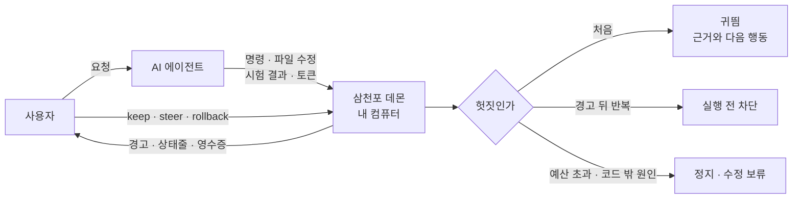
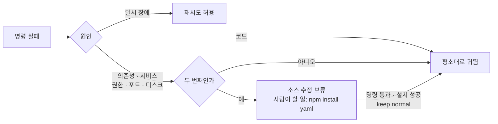
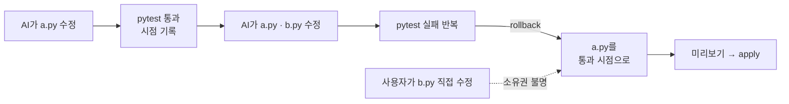

<div align="center">

<picture>
  <source media="(prefers-color-scheme: dark)" srcset="docs/assets/logo-dark.png">
  
</picture>

**AI 코딩 에이전트가 헛짓에 시간과 돈을 태우는 것을 알아채고, 알려 주고, 멈추게 하는 하네스**

[](https://github.com/JinHo-von-Choi/anti-samcheonpo/actions/workflows/ci.yml)
[](LICENSE)
[](https://go.dev/dl/)

한국어 | [English](README.en.md)

</div>

---

## 왜 필요한가

개발자는 AI가 같은 시험을 또 돌리거나 시키지 않은 파일을 고치기 시작하면 바로 알아채고 끼어듭니다. 비개발자는 그 순간을 알아볼 기준이 없습니다. 그사이 AI는 "거의 다 됐습니다"라고 말하고, 시간과 사용 한도는 계속 줄어듭니다.

헛짓은 대개 세 가지 모양입니다.

- **필요 이상의 검증.** 코드는 그대로인데 같은 시험을 몇 번이고 다시 돌립니다.
- **엉뚱한 방향.** 로그인 오류를 고쳐 달라고 했는데 로그인 방식 전체를 갈아엎습니다.
- **같은 자리에서 맴돌기.** 같은 실패를 되풀이하거나, 설치되지 않은 패키지나 꺼진 서버처럼 코드로 풀 수 없는 문제를 코드로 풀려고 합니다.

삼천포는 이런 헛짓을 실행 결과로 잡아내는 로컬 도구입니다. 이야기가 엉뚱한 데로 새는 것을 "삼천포로 빠진다"고 하는 데서 이름을 따왔습니다.

## 동작 방식

삼천포는 에이전트의 훅에 붙어 명령, 파일 수정, 시험 결과, 토큰 사용량을 봅니다. AI가 "통과했다"고 말해도 실제 실행 결과로만 판단합니다. 모든 판단은 내 컴퓨터 안에서 하고, 모델을 호출하지 않습니다.



처음에는 에이전트에게 근거와 함께 귀띔만 합니다. 같은 세션에서 경고를 받고도 같은 대상에 같은 헛짓을 반복하면 다음 실행을 **실행 전에** 막고 이유를 돌려줍니다. 차단은 세션당 3회까지이고, 잘못 막았으면 `/samcheonpo:keep normal`로 풉니다.

사용자에게는 쉬운 말로 알립니다.

```text
AI가 같은 시험을 4번 돌렸는데, 그 사이 코드는 한 글자도 바뀌지 않았습니다.
AI에게 이렇게 말해 보세요: "같은 시험을 다시 돌리지 말고, 직전 실패 원인을 먼저 찾아 줘."
[/samcheonpo:keep now 이번만 허용]  [/samcheonpo:keep normal 이 판정은 틀림]  [/samcheonpo:summary 멈추고 요약 받기]
```

상태줄 맨 앞에는 지금 상태가 보입니다.

```text
[지켜보는 중] 진척 1/2 · 공회전 API환산 1,240원 · 헛짓 12% (계측분)
```

| 상태 | 뜻 |
| --- | --- |
| 순조로움 | 검사 통과 같은 진척 근거가 있고, 그 뒤 경고가 없다 |
| 지켜보는 중 | 아직 진척 근거가 없거나, 가벼운 안내가 있었다 |
| 지금 끼어드세요 | 반복된 헛짓이나 차단이 있다 |
| 확인 불가 | 관측이 빠져 판단할 수 없다 |

> 원화는 **계측한 토큰을 API 단가로 환산한 금액**입니다. 실제 청구액이나 절감액이 아닙니다. 사용량을 모르면 0원이 아니라 "미확인"으로 표시합니다.

## 무엇을 잡나

| 헛짓 | 예 | 개입 |
| --- | --- | --- |
| 과잉 검증 | 코드 변경 없이 같은 시험 반복, 몇 줄 고치고 5분 넘게 걸리는 전체 시험을 바로 재실행, 짧은 확인 없이 긴 부하 시험 시작 | 귀띔 → 반복 시 차단 |
| 맥락 이탈 | 요청 범위 밖 파일 수정, 보호 경로 수정, 맥락 압축 뒤 목표 잊기 | 귀띔, 보호 경로는 즉시 차단, 압축 직후 목표 재안내 |
| 같은 실패 반복 | 고쳐도 같은 오류, 이미 실패한 수정 재시도, 고쳤다 되돌리기, 브라우저 시험 타이밍 땜질, 같은 이유로 계속 거부당하는 제출 | 귀띔 → 반복 시 차단 → 인수인계 |
| 코드 밖 문제 | 설치되지 않은 의존성, 꺼진 서비스, 권한, 포트 점유 | 소스 수정 보류, 사람이 할 일 안내 |
| 허위 완료 | 시험 삭제·skip·단언 약화, 오류 숨기기, 완료 조건이 실패한 채 "완료" | 귀띔 → 반복 시 차단 |
| 배포 연타 | CI 실패를 로컬에서 재현하지 않고 재배포, 실패한 CI를 그대로 다시 돌리기, 시간당 배포 횟수 초과 | 귀띔 → 태그가 바뀌어도 반복 시 차단 |
| 완료 뒤 대기·진행 정체 | 완료 검사를 통과한 뒤 계속 기다림, 수정해도 같은 검사에서 실패가 줄지 않음 | 기본은 기록만, 사용자가 켜면 가벼운 안내 |
| 비용 폭주 | 진척 없는 지출, 예산 초과, 세션 시간·토큰 과다 | 알림 → 확인 → 상한에서 정지 |

대기·정체 안내는 기다리는 이유와 검사 결과를 확인할 수 있을 때만 제공합니다. 두 규칙은 작업을 차단하지 않습니다. 안내를 켜는 방법은 [대기 반복·진행 정체 안내](docs/spec/agenttime-reliability.md)에 있습니다. v0.6.0에 추가했으며 실제 비용·완료율 효과는 아직 검증하지 않았습니다.

### 코드 밖 문제

코드를 아무리 고쳐도 풀리지 않는 실패가 있습니다. 같은 명령이 환경 변화 없이 같은 외부 원인으로 두 번 실패하면, 삼천포는 그 원인이 풀릴 때까지 소스 수정을 막고 사람이 실행할 명령을 알려 줍니다.



보류 중에도 의존성 선언 파일(`package.json`, `requirements.txt`, `go.mod` 등)은 고칠 수 있습니다. 시간 초과와 강제 종료는 코드가 원인일 수 있어 보류하지 않습니다.

### 판단 원칙

1. **결과로 판단합니다.** AI의 자기 보고가 아니라 실행 결과와 작업 폴더 상태를 봅니다.
2. **횟수만으로 막지 않습니다.** 입력과 환경이 그대로이고 새 정보도 진척도 없을 때만 막습니다. 코드를 바꾼 재시도는 막지 않습니다.
3. **막을 때는 이유를 줍니다.** 근거와 다음에 할 일을 함께 돌려줍니다.
4. **모르는 것은 모른다고 합니다.** 계측이 빠지면 미확인, 추정은 추정으로 표시합니다.
5. **기록은 내 컴퓨터에 둡니다.** 원격 전송과 외부 판정 모델은 사용자가 켜기 전에는 쓰지 않습니다.

---

## 설치

### 릴리스 파일

[Releases](https://github.com/JinHo-von-Choi/anti-samcheonpo/releases)에서 `samcheonpo_<버전>_<OS>_<아키텍처>.tar.gz`와 `SHA256SUMS`를 받습니다. linux, darwin, windows용 amd64와 arm64 파일이 있습니다.

```bash
sha256sum -c --ignore-missing SHA256SUMS   # macOS: shasum -a 256 -c --ignore-missing SHA256SUMS
tar -xzf samcheonpo_0.7.0_linux_amd64.tar.gz
mkdir -p ~/.local/bin && cp samcheonpo samcheonpo-hook ~/.local/bin/
samcheonpo doctor
```

`samcheonpo`와 훅 전용 `samcheonpo-hook`은 항상 같은 폴더에 둡니다. Windows는 같은 방법으로 풀어 두 `.exe`를 PATH의 같은 폴더에 두고, Git for Windows를 설치합니다.

### 소스에서 설치

Go 1.27 이상이 필요합니다.

```bash
go install github.com/JinHo-von-Choi/anti-samcheonpo/cmd/samcheonpo@v0.7.0
go install github.com/JinHo-von-Choi/anti-samcheonpo/cmd/samcheonpo-hook@v0.7.0
```

## 빠른 시작

**1. 지난 30일 동안 토큰이 어디에 쓰였는지 봅니다.** 아무것도 바꾸지 않고 모델도 호출하지 않습니다.

```bash
samcheonpo audit --since 30d
```

```text
계측된 토큰               26871.5M토큰
  진척 (추정)              3423.1M토큰    13%
  필요한 탐색             13523.5M토큰    50%
  헛짓                      770.3M토큰     3%
실시간이었다면 개입 1418회
헛짓 상위 세션
  3f2a91c0  09-08 10:10     26.7M토큰  헛짓  18%  결제 화면 오류 고쳐 줘
```

세션 하나를 자세히 보려면 `samcheonpo receipt <세션ID>`를 씁니다.

**2. 쓰는 에이전트에 연결합니다.**

```bash
samcheonpo install --agent claude     # Claude Code (플러그인, 상태줄)
samcheonpo install --agent codex      # Codex
samcheonpo install --agent opencode   # opencode
samcheonpo install --agent agy        # Antigravity CLI
samcheonpo install --agent hermes     # Hermes
samcheonpo install --agent openclaw   # OpenClaw
```

기존 훅과 상태줄 설정은 그대로 둡니다. 새 에이전트 세션부터 적용되며, 첫 훅이 불릴 때 데몬이 자동으로 뜹니다.

**3. 평소처럼 일을 시킵니다.** 경고가 뜨면 아래 명령으로 답합니다(Claude Code 기준).

| 명령 | 하는 일 |
| --- | --- |
| `/samcheonpo:summary` | 요청한 일, 지금 하는 일, 끝난 것, 막힌 것, 쓴 돈을 요약 |
| `/samcheonpo:keep normal` | 방금 판정이 틀렸다고 기록. 같은 목표 안에서 같은 대상은 다시 막지 않음 |
| `/samcheonpo:keep now` | 이번만 허용. 다시 생기면 막기 전에 먼저 안내 |
| `/samcheonpo:steer` | 삼천포의 처방을 에이전트에게 전달 |
| `/samcheonpo:check` | 완료 조건을 지금 검사 |
| `/samcheonpo:rollback` | AI가 바꾼 파일을 마지막으로 검사가 통과한 시점으로 되돌림 |
| `/samcheonpo:extend 2h` | 세션 상한을 늘림. 시간은 `2h`·`30m`, 토큰은 `20M`·`500K` |
| `/samcheonpo:accept`, `/samcheonpo:edit` | 작업 계약 수락·수정 |

다른 에이전트는 터미널에서 `samcheonpo cmd <명령>`으로 같은 일을 합니다. `keep`, `accept`, `extend`, `rollback apply`는 사용자 전용이라 에이전트가 셸로 실행하면 거부됩니다.

**4. 연결을 해제합니다.**

```bash
samcheonpo uninstall --agent claude
```

설치 전 상태로 되돌립니다. 사용자가 고친 파일과 기록은 지우지 않습니다.

## 되돌리기

검사가 통과할 때마다 그 시점의 AI 파일을 `.samcheonpo/snapshots`에 기록합니다. 일이 꼬이면 그 시점으로 돌아갈 수 있고, 데몬이 다시 시작돼도 기록은 남습니다.



**AI가 쓰기 도구로 바꿨고 그 뒤 아무도 손대지 않은 파일만 되돌립니다.** 사람이 고친 파일, 셸 명령으로 바뀐 파일, 링크는 건드리지 않고 미리보기에 이유를 표시합니다. 바꾸기 전 내용은 `~/.samcheonpo/backup/`에 백업합니다.

| 명령 | 기준 시점 |
| --- | --- |
| `/samcheonpo:rollback` → `apply <계획 ID>` | 이 세션에서 마지막으로 검사가 통과한 시점 |
| `/samcheonpo:rollback golden` → `golden <id>` → `golden <id> apply <계획 ID>` | 기록된 통과 시점 가운데 하나(최근 5개) |

## 작업 계약 (선택)

기본은 관찰 전용입니다. 완료 여부를 삼천포가 직접 확인하게 하려면 작업 계약을 씁니다.

```yaml
# .samcheonpo/contract.yml
goal: 로그인 세션이 만료되면 재로그인 화면으로 보낸다
done:
  - check: "pytest -q tests/test_session.py"   # 삼천포가 직접 실행
scope:
  allow: ["src/auth/**", "tests/**"]
  protect: ["migrations/**"]                   # 수정하면 즉시 차단
budget: {krw: 5000, minutes: 40}               # 넘으면 정지
```

`/samcheonpo:accept`로 수락하면 완료 조건으로 진척을 재고, 보호 경로를 지키고, 예산을 넘으면 멈춥니다. 수락 기록은 사용자 홈의 키로 서명하므로 에이전트가 쓴 기록은 인정하지 않습니다. 계약 내용을 바꾸면 다시 수락해야 합니다. 작업마다 에이전트가 계약 초안을 쓰게 하려면 `.samcheonpo.yml`에 `contract: {draft: on}`을 둡니다.

## 설정

사용자 설정은 `~/.samcheonpo/config.yml`, 프로젝트 설정은 `.samcheonpo.yml`입니다.

```yaml
rollout:
  mode: recommend            # shadow: 기록만 | recommend: 귀띔, 승격 가능한 규칙만 반복 시 차단
  escalate_max_blocks: 3     # 반복 귀띔의 차단 상한. 명시적 보호·예산은 별도
  recommend_rules: []        # 사용자 설정에서만 대기·정체 안내를 명시적으로 선택
contract:
  draft: off                 # on이면 작업마다 계약 초안 요청
notify:
  desktop: true
swarm:
  tree_krw: 0                # 부모·자식 세션을 합한 예산(원). 0이면 없음
detectors:
  s8_cost:
    notice_hours: 2          # 활동 시간 알림
    warn_hours: 4            # 계속할지 확인
    ceiling_hours: 0         # 넘으면 읽기만 허용. 0이면 없음
    ceiling_tokens: 0        # 같은 상한을 토큰으로
  s1_verify_treadmill:
    expensive_check_sec: 300 # 이보다 오래 걸린 시험을 작은 변경 뒤 재실행하면 판정
  s5_release:
    releases_per_hour: 2
```

- 대기 반복(`s1.explicit_waiting`)과 진행 정체(`s8.progress_stall`)는 기본으로 기록만 합니다. 안내를 받으려면 사용자 설정의 `rollout.recommend_rules`에 원하는 규칙을 넣습니다. 기록 전용 목록인 `shadow_rules`에 남아 있으면 계속 기록만 합니다. 두 규칙의 최고 수준은 가벼운 안내(L1)입니다.
- 활동 시간은 이벤트 사이 공백이 30분을 넘는 구간을 빼고 셉니다. 계약의 `budget.minutes`도 같은 상한으로 집행합니다.
- 프로젝트 설정은 사용자 설정을 **약하게만** 바꿀 수 있습니다. 차단 상한·예산·세션 상한은 낮추기만 하고, 외부 전송·알림 목적지·외부 프로그램은 끄기만 할 수 있습니다.
- 부모·자식 세션 묶음은 `samcheonpo handoff link`로 이었거나 에이전트가 부모 세션 ID를 보낸 경우에만 생깁니다.

## 지원 범위

| 에이전트 | 지원 | 훅 입력을 확인한 버전 |
| --- | --- | --- |
| Claude Code | 관찰 · 귀띔 · 실행 전 차단 · 상태줄 · 슬래시 명령 | 2.1.x |
| Codex | 관찰 · 귀띔 · 실행 전 차단 | 0.160–0.162 |
| opencode | 관찰 · 귀띔 · 실행 전 차단 | 1.18.x |
| Antigravity(agy) | 관찰 · 귀띔 · 실행 전 차단 | 1.3.x |
| Hermes | 관찰 · 귀띔 · 실행 전 차단 | 0.21.x |
| OpenClaw | 관찰 · 귀띔(다음 요청부터) · 실행 전 차단 | 2026.7.x |
| GitHub Copilot · Cursor | 관찰 | |

에이전트가 업데이트돼도 버전 번호만으로 개입을 끄지 않습니다. 훅 입력에 세션, 도구 이름, 호출 ID, 도구 입력, 결과가 그대로 있으면 계속 개입합니다. 형식이 달라진 입력이 오면 그 에이전트는 관찰만 하고, 상태줄과 `samcheonpo doctor`에 이유를 표시합니다.

운영체제는 Linux, macOS, Windows 10 1803 이상을 지원합니다. Windows는 검사 명령을 Git for Windows의 bash로 실행합니다. 플랫폼별 확인 범위는 [지원 범위](docs/support-matrix.md)에 있습니다.

## 한계

- **효과는 아직 입증 중입니다.** 표본이 작아 일반적인 절감률을 주장하지 않습니다. 실험 방법은 [실험 프로토콜](docs/benchmarks/protocol-v1.md)에 있습니다.
- **오탐이 있을 수 있습니다.** 그래서 처음에는 귀띔만 하고, 경고를 무시했을 때만 세션당 상한 안에서 막습니다. 틀린 판정은 `/samcheonpo:keep normal`로 알려 주세요.
- **실행 전 차단은 15ms 안에 판정이 끝나야 걸립니다.** 넘기면 실행을 막지 않고 상태줄에 `확인 불가`를 표시합니다.
- **되돌리기는 소유권이 확인된 파일만 다룹니다.** 셸 명령으로 바뀐 파일, 사람 편집이 섞인 파일, 다른 세션의 AI가 쓴 파일은 대상이 아닙니다.
- **사용자 전용 명령의 격리는 완전하지 않습니다.** 에이전트 셸에서는 막지만, 같은 OS 사용자로 도는 프로세스가 데몬에 직접 접속하는 것까지 막지는 않습니다.
- **짧고 명확한 작업에서는 할 일이 거의 없습니다.** 헛짓은 대개 길고 복잡한 세션에서 생깁니다.

## 더 알아보기

- [처음 사용하기](docs/getting-started.md): 설치부터 운영 규칙까지
- [지원 범위](docs/support-matrix.md): 플랫폼과 에이전트별로 확인한 것
- [에이전트용 지침](plugins/claude-code/skills/samcheonpo/SKILL.md): AI가 삼천포를 세팅하고 경고에 맞게 행동하는 규칙. Claude Code 플러그인에 함께 설치됩니다
- 규격: [진척 계약](docs/spec/progress-contract-v1.md) · [근거 원장](docs/spec/evidence-ledger-v1.md) · [영수증 표시](docs/spec/receipt-billing.md) · [복구와 코드 밖 원인](docs/spec/recovery-v1.md) · [인수인계](docs/spec/handoff-v1-draft.md) · [대기·정체 안내와 기록 평가](docs/spec/agenttime-reliability.md)
- 평가 도구: `samcheonpo bench`, `samcheonpo bench ab`, `samcheonpo gaps`, `samcheonpo interventions`, `samcheonpo eval corpus`(현재 작업 트리)
- 기록 비교: `samcheonpo report --since 30d --mode live`. 단가 미확인은 무료로 표시하지 않으며, 수집 범위와 완료 근거를 함께 보여 준다.
- 안내 이력: `samcheonpo interventions --by-agent`. 관련 행동이 없는 관측 창은 재발 없음으로 단정하지 않는다.
- [적합성 사례](conformance/): 다른 구현을 같은 규격으로 채점하는 시험 모음

## 라이선스

[MIT](LICENSE)

---

<p align="center">
  Made by <a href="mailto:jinho.von.choi@nerdvana.kr">Jinho Choi</a> &nbsp;|&nbsp;
  <a href="https://buymeacoffee.com/jinho.von.choi">Buy me a coffee</a>
</p>
