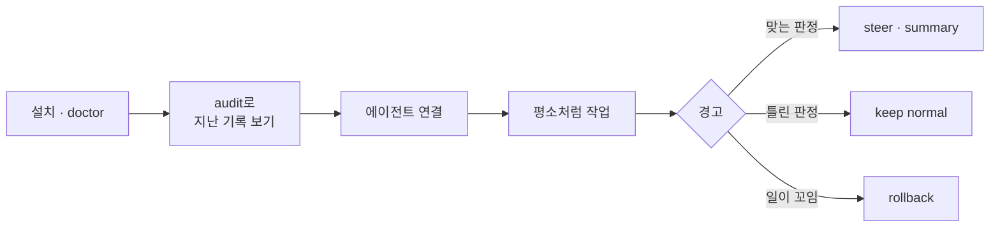
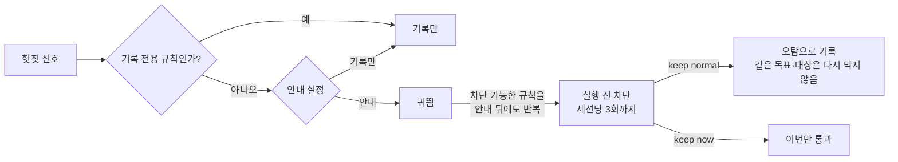

# 처음 사용하기

삼천포는 AI의 행동을 실행 결과로 관측해 원래 목표와 비교하는 도구다. AI가 항상 옳은지 인증하지 않으며, 화면의 원화는 API 단가로 환산한 금액이지 실제 청구액이나 절감액이 아니다.



## 1. 설치와 점검

[README의 설치 절](../README.md#설치)대로 `samcheonpo`와 `samcheonpo-hook`을 같은 폴더에 둔 뒤 점검한다.

```sh
samcheonpo doctor
```

- `doctor`는 설정을 바꾸거나 데몬을 띄우거나 모델을 호출하지 않는다.
- 첫 실행 전에는 원장이 없다는 경고가 정상이다. `completion`의 계약 없음·미수락 경고는 완료 근거가 없다는 뜻이며 설치 실패가 아니다.
- 원장 읽기 오류나 무결성 오류가 나오면 원장을 지우지 말고 원인을 먼저 해결한다. 업그레이드 직후의 스키마 경고는 `samcheonpo sessions`를 한 번 실행하면 사라진다.
- 실행 파일을 옮겼으면 기존 연결이 따라오지 않으므로 `uninstall` 후 다시 `install`한다.
- `SHA256SUMS`가 같다는 것은 다운로드가 깨지지 않았다는 뜻일 뿐, 배포자 신원이나 프로그램 안전성을 보증하지 않는다.

## 2. 지난 기록부터 보기

```sh
samcheonpo audit --since 30d
samcheonpo sessions
samcheonpo report --since 30d --mode live
samcheonpo receipt <세션ID>
```

이미 저장된 Claude Code·Codex 기록을 읽으며 모델을 호출하지 않는다. 사용량을 읽지 못한 부분은 0원이 아니라 미확인으로 표시한다. 기록이 없으면 결과가 비어 있어도 정상이다.

`report`는 에이전트와 수집 모드별로 기록을 묶는다. 단가가 하나라도 빠지면 토큰 기준 비율과 단가 확인 범위를 표시한다. 일부 환산액은 전체 금액이 아니다. ‘활동 진척 분류’와 ‘검사 관측’도 작업 완료를 뜻하지 않는다. 에이전트별 수집 범위가 다르면 순위로 비교하지 않는다.

보고서의 ‘마지막 활동’은 마지막 관측 이벤트 시각이다. 데몬을 닫은 시각은 실제 작업 종료와 구별한다. 구버전 기록은 종료 이유와 판정기 버전이 미확인일 수 있다. 관측 호출 해시가 있어도 원본 대화를 완전히 재생할 수 있다는 뜻은 아니다.

## 3. 에이전트 연결

쓰는 에이전트에만 설치한다.

```sh
samcheonpo install --agent claude   # codex, opencode, agy, hermes, openclaw
```

- 기존 훅과 상태줄은 그대로 둔다.
- 새 에이전트 세션부터 적용된다. 에이전트가 플러그인이나 훅의 신뢰를 물으면 승인해야 동작한다.
- agy는 `~/.gemini/config/hooks.json`에 `samcheonpo` 훅 묶음만 더한다.
- Hermes와 OpenClaw는 플러그인을 쓴 뒤 각 에이전트 명령(`hermes plugins enable`, `openclaw plugins install`)으로 켠다. 실행 중인 게이트웨이는 재시작해야 적용된다.
- Claude Code의 플러그인 등록을 직접 하려면 `--no-plugin-cli`를 붙인다. 이때는 새 세션에서 플러그인이 실제로 로드됐는지 확인한다.
- 이미 설치돼 있다는 메시지가 나오면 같은 `--agent`로 `uninstall`한 뒤 다시 설치한다. 업그레이드 뒤 플러그인 파일을 갱신할 때도 같다.

## 4. 경고와 상태 읽기

경고는 관측 사실, 다음 행동, 끝나는 조건으로 나뉘어 있다. 사용자 화면에는 관측 두 줄 이내, AI에게 그대로 붙여 넣을 요청 한 문장, 선택지가 나온다.

상태줄 맨 앞 상태는 네 가지다.

| 상태 | 뜻 |
| --- | --- |
| 순조로움 | 마지막 진척 뒤 경고가 없고 진척 근거가 있다. 수락한 계약이 있으면 완료 조건 검사가 하나 이상 통과해야 하고, 없으면 추정 진척으로 충분하다(실패 중인 검증이 없을 때 코드가 늘어난 쓰기, 실패가 줄어든 검증, 쓰기 뒤 처음 통과한 검증) |
| 지켜보는 중 | 진척 근거가 아직 없거나, 마지막 진척 뒤 가벼운 안내가 있었다 |
| 지금 끼어드세요 | 마지막 진척 뒤 강한 경고가 있거나, 풀리지 않은 차단(보호 경로 등)이 있다 |
| 확인 불가 | 관측 누락, 기록 저장 실패, 기한을 넘긴 실행 전 판정이 있다 |

경고가 없다는 사실만으로 `순조로움`을 표시하지 않는다. 이미 통과한 검사는 입력·환경·코드가 같을 때만 재사용한다.

## 5. 귀띔에서 차단까지



- 기본은 안내 모드(`rollout.mode: recommend`)다. 기록 전용 모드(`shadow`)에서는 판정만 저장한다. 안내·복구 권고·자동 검사 실행은 하지 않는다.
- 기록만 하는 규칙도 있다. 기본 목록은 `s1.verify_after_docs`, `s1.review_repeat`, `s1.explicit_waiting`, `s8.progress_stall`이다. 대기·정체 두 규칙은 사용자가 안내를 켜야 메시지를 보내며, 반복돼도 작업을 차단하지 않는다.
- 차단은 같은 세션, 같은 목표 안에서 귀띔을 받은 에이전트가 같은 규칙을 같은 대상(파일 또는 명령)에 다시 어길 때만 건다.
- 같은 검사 재실행, 실패 반복, 오류 숨기기, 시험 약화, 작은 변경 뒤 전체 시험 재실행, CI 실패 뒤 재배포, 배포 연타, 프로브 없는 장시간 실행, 거부당한 명령의 재실행은 계약 없이도 차단까지 간다. 범위, 완료 조건, 검증 비율처럼 계약에 기대는 규칙은 수락한 계약이 있을 때만 차단한다.
- 세션당 차단 상한은 `rollout.escalate_max_blocks`(기본 3, 0이면 끔)다.
- 사용자가 수락한 보호 경로와 명시한 예산은 어느 단계에서도 지킨다.
- `keep normal`은 현재 목표 안의 같은 규칙·같은 대상에만 적용된다. 다른 대상과 새 목표, 보호 경로와 예산에는 영향이 없다. `keep now`는 이번 한 번만 넘기고, 같은 일이 다시 생기면 막기 전에 먼저 안내한다.

## 6. 코드 밖 원인과 수정 보류

실패한 명령의 출력과 종료 코드로 원인을 나눈다. 설치되지 않은 의존성·명령, 실행 권한 없음, 주소 해석 실패, 접속 거부, 권한 없음, 포트 점유, 인증 거부, 디스크 부족은 코드 밖 원인이다.

같은 명령이 작업 폴더 변화 없이 같은 코드 밖 원인으로 두 번 실패하면, 원인이 풀릴 때까지 소스 파일 쓰기를 실행 전에 보류하고 사람이 실행할 명령을 알려 준다. 사용자 화면에는 "사람이 확인할 일: `npm install yaml`"처럼 나온다.

- 의존성 선언 파일(`package.json`, `requirements.txt`, `go.mod` 등)과 `.samcheonpo/`는 보류 중에도 쓸 수 있다.
- 같은 명령이 통과하거나, 설치·서비스 기동 명령이 성공하거나, `/samcheonpo:keep normal`로 풀면 보류가 끝난다.
- 이름 해석 일시 실패, 시간 초과, 연결 끊김 같은 일시 장애는 재시도 기회를 준다. 종료 코드 124(시간 초과)와 137(강제 종료)은 코드 원인일 수 있어 보류하지 않는다.
- 보류도 다른 차단과 같이 귀띔이 먼저 가고, 세션당 차단 상한 안에서만 거부한다.

## 7. 장시간 세션

오래 도는 세션에서 시간을 크게 잃는 행동은 따로 판정한다.

- **작은 변경 뒤 오래 걸리는 시험 재실행.** 지난번 실행이 `expensive_check_sec`(기본 300초) 이상 걸린 시험이 대상이다. 바뀐 파일과 연결된 시험이 먼저 통과했으면 전체 시험 한 번은 허용한다. 실행 스크립트로 감싸거나 스크립트 이름을 바꿔도 같은 시험으로 본다.
- **짧은 확인 없는 장시간 실행.** 실행 시간을 명시한 부하·장시간 실행(`k6 run --duration 2h`, `locust -t 30m`)은 300초까지 바로 허용하고, 그보다 길면 같은 대상의 짧은 실행이 통과한 길이의 6배까지만 허용한다. 코드가 바뀌면 그 기록은 무효가 된다. `timeout 600 npm test`의 `timeout`은 상한일 뿐 실행 시간으로 보지 않는다.
- **CI 실패 뒤 재배포.** `gh run watch/view/list`, `gh pr checks`, `glab ci`로 원격 CI 실패를 확인한 뒤 다시 배포하려면, CI가 지목한 실패 시험이나 전체 범위·장시간 검사가 로컬에서 통과해야 한다. 직전 배포 뒤 고친 내용에 통과한 검사가 없거나, 브라우저 시험이 타이밍으로 실패한 상태이거나, 한 시간에 `releases_per_hour`(기본 2)번을 넘겨 배포해도 판정한다. 태그가 바뀌어도 같은 판정이다.
- **실패한 CI를 그대로 다시 돌리기.** 같은 커밋의 실패한 CI를 `gh run rerun`·`glab ci retry`로 다시 돌려 또 실패하면 헛짓으로 센다. 다시 돌린 CI가 통과하면(불안정한 실패) 세지 않는다.
- **세션 길이.** 활동 시간 2시간 또는 토큰(입력·출력·캐시 쓰기) 1천만이면 상태줄에 표시하고, 4시간 또는 3천만이면 계속할지 묻는다. 활동 시간은 이벤트 사이 공백이 30분을 넘는 구간을 빼고 센다.
- **세션 상한.** `detectors.s8_cost.ceiling_hours`·`ceiling_tokens`나 계약의 `budget.minutes`로 상한을 정하면, 넘는 순간부터 파일 변경·검사·명령 실행·서브에이전트 호출을 거부하고 읽기만 허용한다. `/samcheonpo:extend 2h`(토큰은 `20M`처럼 대문자)로만 늘릴 수 있고 `keep`으로는 풀리지 않는다.

### 대기 반복·진행 정체 안내 켜기

작업이 끝났는데 계속 기다리거나, 수정해도 같은 검사에서 실패가 줄지 않는지 살펴본다. 기본으로는 기록만 남긴다. 안내를 받으려면 사용자 설정 `~/.samcheonpo/config.yml`에 아래 항목을 합친다.

```yaml
rollout:
  mode: recommend
  recommend_rules: [s1.explicit_waiting, s8.progress_stall]
```

첫 이름은 대기 반복, 두 번째 이름은 진행 정체 규칙이다. 하나만 선택해도 된다. 기존 `shadow_rules` 목록에도 같은 규칙이 있으면 그 목록에서는 빼야 안내한다. 프로젝트에서 기록 전용으로 지정한 규칙은 계속 기록만 한다.

안내에 필요한 근거는 다음과 같다.

- **대기 반복:** 수락한 계약의 완료 검사와 필요한 관찰이 끝났는지 확인할 수 있어야 한다.
- **진행 정체:** 같은 검사에서 입력이 바뀌었는지, 실패가 줄었는지 비교할 수 있어야 한다. 현재는 삼천포가 직접 실행한 v2 계약 검사를 사용한다.

기다리는 이유를 모르거나 파일 감시에 실패하면 판단을 보류한다. 사람이 확인할 완료 조건이 포함된 계약은 대기 안내를 보류한다. 두 규칙은 가벼운 안내만 하며 작업을 차단하거나 예산 상한을 늘리지 않는다. 상세 조건과 기록 평가 방법은 [대기 반복·진행 정체 안내](spec/agenttime-reliability.md)에 있다.

### 완료 근거가 미확인일 때

프로젝트에서 `samcheonpo contract show`로 조건을 확인하고, 필요하면 `.samcheonpo/contract.yml`의 완료 조건을 작성한다. 검토·조사 작업은 파일 변경 대신 결과물을 조건으로 삼을 수 있다. 사용자가 조건을 수락한 뒤 `samcheonpo contract accept`, `samcheonpo cmd checkpoint` 순서로 실제 검사를 확인한다. 수락만으로 통과가 되지는 않으며 사람이 확인할 조건은 별도로 남는다. 진단 명령은 수락이나 검사를 대신 실행하지 않는다.

`samcheonpo interventions --since 30d --by-agent`는 에이전트·규칙별 전달 단계와 미관측 사유를 보여 준다. 안내와 같은 실행의 후속 완료 결과 또는 관련 생산 행동을 확인해야 ‘재발 없음’으로 기록한다. 관련 행동이 없거나 외부 검사가 아직 확인되지 않으면 미관측이다. 재발이 없다는 기록은 해결이나 비용 절감의 증거가 아니다.

## 8. 되돌리기

`/samcheonpo:rollback`(터미널에서는 프로젝트 폴더에서 `samcheonpo cmd rollback`)은 AI가 쓰기 도구로 바꾼 파일을 마지막으로 검사가 통과한 시점으로 되돌린다. 그런 시점이 없으면 AI가 이 세션에서 처음 쓰기 전 상태가 기준이다.

1. 인자 없이 실행하면 미리보기와 계획 ID가 나온다.
2. `apply <계획 ID>`로 실행한다. 미리본 뒤 파일이 바뀌어 계획이 달라졌으면 적용하지 않는다.

대상 규칙:

- 쓰기 도구의 입력으로 결과를 재현할 수 있고, 실제 파일이 그 결과와 같았던 파일만 대상이다. AI 편집 사이에 다른 편집이 섞인 파일은 소유권 불명으로 뺀다.
- AI가 마지막으로 쓴 뒤 사용자나 다른 명령이 바꾼 파일은 건너뛴다.
- AI가 새로 만든 파일은 삭제한다.
- 프로젝트 밖으로 이어지는 경로, 심볼릭 링크, 하드링크, 특수 파일, 셸 명령으로 바뀐 파일, 1MB를 넘는 파일, 세션 보관 용량(64MB)을 넘긴 뒤의 파일은 대상이 아니다. 미리보기에 이유와 함께 나온다.
- 바꾸기 전 내용은 `~/.samcheonpo/backup/rollback/<세션>/<시각>/`에 백업하고, 실행 결과는 원장에 남긴다.

**기록된 통과 시점.** 검사가 통과할 때마다 그 시점의 AI 소유 파일을 `.samcheonpo/snapshots/<id>/`에 기록한다(최근 5개, 64MB 상한). 데몬이 다시 시작돼도 남는다. `/samcheonpo:rollback golden`으로 목록을 보고, `golden <id>`로 미리보기, `golden <id> apply <계획 ID>`로 실행한다. 소유권 규칙은 같고, 다른 세션의 AI가 쓴 파일은 대상이 아니다.

`.samcheonpo/`를 저장소의 `.gitignore`에 넣어 두면 기록이 커밋에 섞이지 않는다.

## 9. 설정 권한

프로젝트의 `.samcheonpo.yml`은 사용자 설정(`~/.samcheonpo/config.yml`)을 약하게만 바꿀 수 있다.

| 항목 | 프로젝트 설정으로 할 수 있는 일 |
| --- | --- |
| 외부 프로그램(`iron_laws.path`), 알림 목적지(`notify.push`), 판정 모델(`detectors.s3_drift.judge`), 실험 모드(`experiment.enabled`) | 끄기만 |
| 탐지 기준, 귀띔·알림·정지 기준, 반복 대기, 종료 보류 횟수 | 느슨하게만 |
| 차단 상한, 군집 예산, 세션 상한(`ceiling_hours`·`ceiling_tokens`) | 낮추기만 |
| 검증 명령 목록(`verify_commands`) | 추가 |
| `rollout.mode`, `validated_rules`, `recommend_rules` | 사용자 단계·승인보다 확대 불가 |
| `rollout.shadow_rules` | 추가만, 사용자 목록 제거 불가 |

실험 모드는 기본으로 꺼져 있다. 켜면 일부 안내를 대조군으로 보류해 전달하지 않고, 상태줄에 그 사실을 표시한다. 자세한 평가 절차는 [보고서 양식](benchmarks/report-template.md)에 있다.

## 10. 사용자 전용 명령

`accept`, `edit`, `skip`, `keep`, `extend`, `rollback apply`와 세션 밖의 `contract accept`는 사용자의 판단을 바꾸는 명령이다. 슬래시 명령이나 사용자 터미널에서만 동작하고, 에이전트가 셸 도구로 실행하면 실행 전에 거부한다. 스크립트 안에서 부르는 것도 거부하지만, 파일에 쓰는 문서 안에 명령 이름이 있는 것은 실행으로 보지 않는다. 같은 OS 사용자로 도는 프로세스가 데몬 소켓에 직접 접속하는 것까지 막지는 않는다.

## 11. 제거와 복구

```sh
samcheonpo uninstall --agent claude   # 설치한 에이전트마다 같은 --agent로
```

- 설치 후 사용자가 바꾼 상태줄은 덮어쓰지 않고 충돌을 알린다.
- 원장, 영수증, 기록, 실행 파일은 지우지 않는다. 실행 파일은 직접 정리한다.
- 생성 기록과 내용이 같은 파일만 제거한다. 사용자가 수정했거나 추가한 파일은 남기고 알린다.
- 설치나 제거가 실패하면 설치 기록과 백업을 그대로 두고, 다시 설치하기 전에 `doctor`로 원인을 확인한다.
- 설정 파일이 심볼릭 링크면 교체하지 않는다. 링크 대상의 실제 경로를 지정한다.

## 12. 인수인계와 개인정보

`samcheonpo handoff <세션> --format json`과 `handoff inspect`로 다른 에이전트나 새 세션에 일을 넘긴다. 이 JSON은 원문을 담은 로컬 자료이므로 공개 공유용이 아니다.

작업 카드의 목표, 후속 요청, 출처는 재시작과 인수인계를 위해 로컬 원장에 남는다. `store_raw_text: false`도 작업 카드와 짧은 이벤트 요약까지 비식별화하지는 않는다. 계약, 원장, 인수인계 자료는 비공개로 다루고, 공유가 필요하면 `receipt --share`나 `export --redact` 결과를 검토한 뒤 공유한다.
