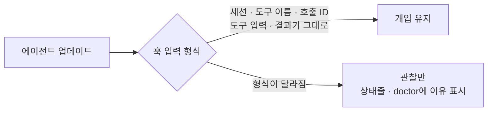

# 지원 범위

확인 수준은 세 가지다.

- **실제 실행**: 실제 에이전트 세션에서 훅이 불리고 판정·귀띔·차단이 전달되는 것을 확인했다.
- **CI 시험**: 해당 OS의 GitHub Actions 러너에서 데몬·훅·되돌리기·설치를 포함한 전체 시험과 적합성 사례가 통과한다.
- **미확인**: 빌드는 되지만 위 두 가지를 확인하지 않았다.

## 운영체제

| 환경 | 배포 파일 | 확인 수준 | 비고 |
| --- | --- | --- | --- |
| Linux x86-64 | 있음 | 실제 실행 | Claude Code, Codex, agy, Hermes, OpenClaw |
| Linux arm64 | 있음 | 배포 파일 설치 확인 | 실제 에이전트 실행 미확인 |
| macOS (amd64, arm64) | 있음 | CI 시험 | 실제 에이전트 실행 미확인 |
| Windows (x64, arm64) | 있음 | CI 시험, 실제 실행(arm64, Claude Code) | 다른 에이전트 미확인 |
| WSL | Linux 파일 사용 | 미확인 | |

배포 파일은 플랫폼마다 그 플랫폼의 러너에서 빌드하고, API 키 없는 설치·제거·감사·첫 훅 확인을 통과한 것만 올린다.

### Windows

- Windows 10 1803 이상이 필요하다(유닉스 도메인 소켓).
- 계약의 `check:` 같은 검사 명령은 Git for Windows의 `bash`로 실행한다. 없으면 `cmd.exe`로 실행되어 `&&`, `test -s`, 작은따옴표 같은 POSIX 문법이 같은 뜻으로 동작하지 않는다. `samcheonpo doctor`의 `shell` 항목에서 어느 쪽인지 확인한다.
- `bash.exe`를 직접 지정하려면 `SAMCHEONPO_SHELL`에 경로를 넣는다. System32의 `bash.exe`는 WSL 실행 파일이라 쓰지 않는다.
- 데몬 소켓 폴더(`%USERPROFILE%\.samcheonpo\run`)는 현재 사용자와 SYSTEM만 접근할 수 있고, 접속한 프로세스가 같은 사용자인지 확인한다.

## 에이전트

| 에이전트 | 연결 방식 | 개입 | 제약 |
| --- | --- | --- | --- |
| Claude Code 2.1.x | 플러그인 (훅, 상태줄, 슬래시 명령) | 귀띔, 실행 전 차단 | |
| Codex 0.160–0.162 | `~/.codex/hooks.json` | 귀띔, 실행 전 차단 | 상태줄과 슬래시 명령이 없어 `samcheonpo cmd`를 쓴다 |
| opencode 1.18.x | 전달용 플러그인 | 귀띔, 실행 전 차단 | |
| Antigravity(agy) 1.3.x | `~/.gemini/config/hooks.json`의 `samcheonpo` 묶음 | 다음 모델 호출에 귀띔, 실행 전 차단 | 훅이 도구 결과를 주지 않아 대화 기록에서 읽는다. 셸 결과는 다음 이벤트에 반영된다. 세션 종료 이벤트가 없어 종료 영수증을 만들지 않는다 |
| Hermes 0.21.x | 플러그인 + `hermes plugins enable` | 도구 결과에 귀띔, 실행 전 차단 | 종료 보류는 코드를 고친 차례에서만 불린다. 실행 중인 게이트웨이는 재시작해야 적용된다 |
| OpenClaw 2026.7.x | 플러그인 + `openclaw plugins install` | 다음 요청에 귀띔, 실행 전 차단 | 실행 중에 도구 결과를 모델에 보여 줄 훅이 없어 같은 실행 안의 반복은 막지 않는다. 실행 중인 게이트웨이는 재시작해야 적용된다 |
| GitHub Copilot, Cursor | 훅 | 관찰만 | |

표의 버전은 훅 입력을 실제로 수집해 시험에 넣은 범위다. 범위 밖 버전이라고 개입을 끄지는 않는다.



`samcheonpo doctor --agent <이름>`은 에이전트 버전, 연결 설정, 훅 형식 불일치 여부를 보여 준다. 버전이 범위 밖이라는 안내는 오류가 아니다. `hook_shape` 경고가 나오면 삼천포를 업데이트한다.

## 기능별 확인 범위

| 기능 | 실제 에이전트로 확인 | 시험으로만 확인 |
| --- | --- | --- |
| 같은 실패 반복의 귀띔과 실행 전 차단 | Claude Code, Codex, agy, Hermes, OpenClaw | |
| 코드 밖 원인 수정 보류 | Claude Code (보류 사유 전달) | 두 번째 쓰기 거부, `keep normal` 해제 |
| 통과 시점 기록과 `rollback golden` | Claude Code (기록, 목록, 미리보기) | `apply` (사용자 전용) |
| 전체 시험 재실행, 장시간 실행, 배포 연타, 반복 거부, 브라우저 타이밍, 세션 길이 | 지난 Codex 기록 감사에서 판정 | 실시간 귀띔·차단 전달 |
| 군집 예산, 압축 뒤 목표 재안내, HUD | | 흐름 시험, 적합성 사례 |
| 훅 형식에 따른 개입 유지와 관찰 전환 | 수집한 Codex 훅 입력 통과 | 형식이 바뀐 입력 |
| 완료 근거 뒤 명시적 대기 반복 (`s1.explicit_waiting`) | 미확인 | 로컬 판단·복원·합성 기록 시험. 기본은 기록만 |
| 입력 변화 뒤 관련 검사 실패 정체 (`s8.progress_stall`) | 미확인 | 로컬 판단·직접 검사 연결·합성 기록 시험. 기본은 기록만 |

시험에 통과한 기능이라도 바로 안내를 보내는 것은 아니다. 기록 전용 상태를 `shadow`라고 부른다. 기본 기록 전용 규칙은 `s1.verify_after_docs`, `s1.review_repeat`, `s1.explicit_waiting`, `s8.progress_stall`이다.

대기·정체 두 규칙의 안내는 사용자가 `rollout.recommend_rules`에서 켠다. 안내를 켜도 작업을 차단하지 않는다. 프로젝트 설정은 기록 전용 규칙을 추가할 수 있다. 사용자 설정에서 정한 기록 전용 규칙을 제거하거나 안내 권한을 추가할 수는 없다. 오탐은 `/samcheonpo:keep normal`로 알린다.

### 대기·정체 기능에서 확인한 것 (2026-10-10)

v0.6.0에 포함했으며 로컬 시험을 수행했다.

- 전체 Go 시험·관련 race 검사·vet와 적합성 20건을 통과했다. race 검사는 동시에 실행되는 코드의 충돌을 찾는 검사다.
- 합성 기록 6건으로 탐지 결과를 확인했다. 실제 AgentTime 기록의 성능 평가는 남아 있다.
- 훅 200회가 모두 응답했다. 시간 초과·실패·큐 누락은 0이었다. 처리 시간 p95는 2.53ms로, 요청 95%가 이 시간 안에 처리됐다.
- 호스트의 파일 감시 자원이 고갈돼(inotify `ENOSPC`) 마지막 검사에서 정상 감시가 필요한 통합 시험 2건을 건너뛰었다. 감시 실패·용량 초과 때 판단을 보류하는 동작은 별도로 시험했다.

실제 에이전트에서의 새 안내 전달은 아직 확인하지 않았다. 안내를 켠 경우와 끈 경우의 완료율·비용·오탐 비교(G12)도 남아 있다. 사용법과 제약은 [대기 반복·진행 정체 안내](spec/agenttime-reliability.md)에 있다.

## 성능

- 훅 처리 지연 목표는 p95 10ms다.
- 실행 전 판정은 15ms 안에 끝나야 차단으로 전달된다. 넘기면 실행을 막지 않고 상태줄에 `확인 불가`와 시간 초과 건수를 표시한다.

## 릴리스 후보 직접 만들기

```sh
sh scripts/package-release.sh 0.6.0-dev ./release-out
```

현재 플랫폼에서 두 실행 파일을 빌드하고, API 키 없는 격리 환경에서 설치·제거·감사·첫 훅을 확인한 뒤 `tar.gz`와 `SHA256SUMS`를 만든다. 출력 폴더가 이미 있으면 덮어쓰지 않고, 호스트와 대상 플랫폼이 다르면 거절한다. `BUILD.txt`에 버전, 커밋, 도구 체인, 작업 트리 변경 여부를 남긴다.

`.github/workflows/release.yml`은 수동 실행(`workflow_dispatch`)으로 여섯 플랫폼의 후보를 만들어 artifact로 올린다. 태그와 GitHub Release는 만들지 않는다.
